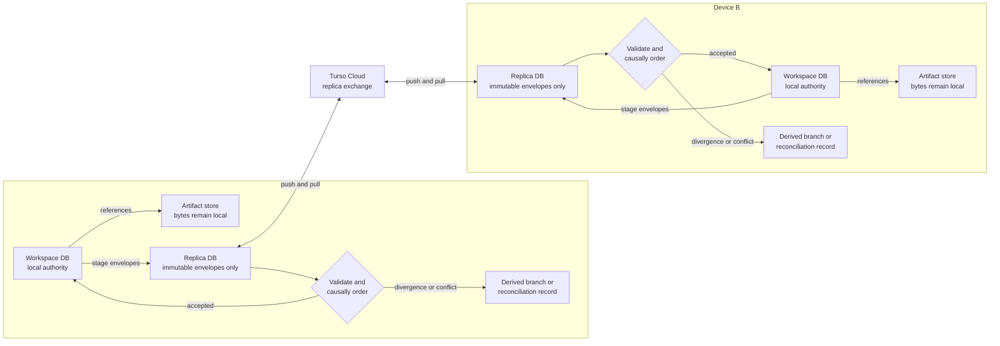

# Architecture and capability boundaries

Agencity separates durable agent state from disposable computation. A local workspace database retains the event history and query projections needed to reconstruct work; content-addressed artifact storage holds larger immutable bytes; a Bun worker executes generated TypeScript without owning the agent's identity. Runtime services validate changes, execute external work through a recorded queue, and expose the same state to terminal and protocol clients.

This document describes which records are authoritative, which components may be replaced, and which guarantees are unavailable. The [capability reference](./capabilities.md) provides a shorter product-level summary.

## Recovery invariant and authority

At every **committed cell boundary**, state needed later must be one of:

- a canonical event and its typed payload;
- a named JSON working value;
- a registered content-addressed artifact reference plus available bytes;
- an external resource reference/outcome explicitly represented by an effect event.

The Bun heap, console globals, open handles, child processes, notifications, snapshots, and outbox leases are not durable identity. `events` is canonical. The reducer plus retained artifact contents projects `AgentState`; snapshots accelerate this and may be discarded. External files/services remain external and can change independently.

## Dependency direction

```text
                     domain
        (events, JSON, reducer, state, errors)
             ^         ^          ^
             |         |          |
      storage contract |   artifact/executor contracts
             ^         |          ^
       LibSQL adapter  |  placement adapters
              \        |        /
               runtime services
             /        |        \
       console host  protocol    TUI
                         ^
                        CLI (composition entrypoint)
```

- `src/domain` has no adapter/runtime imports. Its event and state semantics are placement-independent.
- `src/storage/contract.ts` uses only domain values. Only `src/storage/libsql.ts` and `src/storage/turso.ts` may import LibSQL/Turso SDKs; the modern `@tursodatabase/sync` package is confined specifically to `src/storage/turso.ts`, and emitted package declarations must not expose SDK types.
- Artifact and executor interfaces expose stable IDs, JSON requests, four-way outcomes, and explicit failures rather than filesystem/child-process types.
- Runtime services compose contracts and own valid writes. Generated console SQL is analytical/read-only; SDK RPC invokes typed commands.
- Protocol and UI adapt runtime operations. The product TUI is a full-screen OpenTUI client over the authenticated loopback `AgentClient`; explicit diagnostic TUI routes use `InProcessProtocolTransport` through the same public `ProtocolServer.handle` router. Both retain snapshot-plus-cursor semantics and keep presentation state non-canonical.

`bun run check:architecture` makes the first two boundaries, package barrels, migration classifications, immutable guards, and canonical SQL rules executable.

## Relational storage

### Domain contract

`AgentStorage` owns append/stream event operations, branch lookups, snapshots, outbox claims, analytical reads, migration, and post-commit wakeups. Its public values are `AgentEvent`, `AgentState`, `JsonValue`, `OutboxRecord`, and domain request types. It is not a generic cross-database query abstraction.

| Capability | `LibSqlStorage` | Boundary meaning |
|---|---:|---|
| `offlineWrites` | yes | A local `file:` database can accept writes without a cloud service. |
| `analyticalSql` | yes | LibSQL-oriented, parameterized read-only SQL is available to console/runtime callers. |
| `notifications` | yes | In-process callbacks wake subscribers after this adapter commits. This is not distributed notification. |
| `distributedLeases` | no | Outbox claims are local DB transactions; there is no globally connected coordinator or ownership failover. |

The adapter retains a supervisor write/read client and creates a short-lived query-only analytical client per generated query so a deadline can close it without poisoning canonical writes. Local file databases enable write-ahead logging (WAL) and apply a connection-local `busy_timeout`. Local writes are serialized before SQLite transactions; independent processes still contend through SQLite, so complete database-only transaction and read/statement boundaries retry `SQLITE_BUSY`/`SQLITE_LOCKED` a bounded number of times with jitter. A retry always replays the whole database boundary after rollback, never an executor call or other external effect, and semantic validation/ownership conflicts are not retried. Exhausted ordinary contention becomes `DEPENDENCY_FAILURE`; exhausted process-lease contention becomes `EXECUTION_OWNERSHIP_CONFLICT` with `reason: sqlite_contention_exhausted`, rather than exposing an adapter `LibsqlError`.

Event append plus affected routing/context/outbox rows occurs in one local transaction. Before insertion, local commands are reduced against the transaction-visible branch state; nonexistent targets and invalid transitions are rejected atomically. Synchronized remote envelopes use a separate ingestion path that quarantines invalid input instead of weakening local command validation. Event IDs are ULIDs and event cursors are zero-padded local sequence numbers. Cursors are ordering tokens, not portable timestamps.

`HttpRelationalStateStore` exposes the `AgentStorage` contract through a capability-negotiated JSON/HTTP adapter. Its current protocol supports canonical and recursive operations but does not provide offline writes, commit notifications, or same-device process fencing. Local and HTTP-backed relational placements share conformance coverage. The adapter is a replaceable transport boundary; this repository does not supply hosted relational infrastructure, tenancy, or service operations. [ADR 0011](./decisions/0011-capability-preserving-placement-contracts.md) records the shared placement rules.

PostgreSQL remains unavailable. Optional Turso Cloud exchange uses a **separate envelope replica database**, leaving the workspace database locally authoritative and complete. A raw `syncUrl` on `LibSqlStorage` is not a synchronization lifecycle; `SyncService` owns staging, native exchange, ingestion, status, quarantine, reconciliation, and interval/reconnect behavior.

## Turso Cloud synchronization

`ProfileStore` is a separate local LibSQL database containing a restart-stable device/profile identity, cross-workspace preferences, version-pinned globally installed skills, opaque credential references, and a workspace catalog. This device and preference state is named `userProfile` when it appears beside session-owned profile state. Credential values are never accepted. Each workspace retains its own canonical database and configured content-addressed artifact placement.



Only immutable envelopes cross the cloud boundary. Artifact bytes, workspace snapshots, outbox leases, and other mutable operational projections remain local.

Cloud exchange uses a second local file through `TursoSyncTransport` and pinned `@tursodatabase/sync@0.7.2`. Its `connect()` URL callback returns `null` during initialization, schema creation, staging, queries, checkpointing, and stats, and returns the configured URL only during an explicit official `push()` or `pull()`. This is the installed offline-first equivalent of `bootstrapIfEmpty:false`. Cloud exchange does not use remote schema administration, database-client swapping, frame-replication APIs, or an invented `sync()` wrapper. Rejected network calls leave the same local database and unsent change-data-capture (CDC) operations usable. Capabilities truthfully advertise directional push/pull/checkpoint/stats for this adapter; the deterministic in-process hub remains `bidirectional-only`.

Only immutable, globally keyed `ReplicatedEnvelope` rows travel through the replica database. Turso Sync pushes logical CDC statements with last-push-wins conflict settlement, so physical envelope identity hashes the origin tuple plus event content; logical event ID and origin sequence are indexed claims, not transport primary keys, so colliding raw claims remain available for quarantine and reconciliation. Workspace `events.sequence`, snapshots, outbox leases, and other mutable projections never rely on libSQL's replicated last-write behavior. Envelopes carry device/origin sequence, exact event identity, source-branch parent, dependency IDs, and a stable SHA-256 digest. Ingestion validates schema/integrity, compares duplicate-event content digests, topologically orders causal parents, deterministically orders concurrent envelopes, and quarantines divergent/invalid/incomplete input before canonical append. Durable per-origin staging and terminal-ingest frontiers avoid rescanning settled history; a pending dependency stops frontier advancement and receipts/quarantine remain the correctness boundary. An immutable replica-incarnation marker detects a lost/replaced local sync file and clears only the staging frontier so canonical history is restaged.

If two devices advance one historical branch offline, the local execution stream stays on its original branch and the remote stream is mapped to a deterministic derived branch at the shared parent. Both histories remain inspectable. Duplicate intents and rejected mutations enter reconciliation records. Competing `TaskStatusChanged(...running)` claims produce an unresolved `task_claim`; no last-writer policy chooses an owner. `sessions.execution_owner_device_id` remains the creating device. Only that device materializes effect/goal/heartbeat/model requests as locally executable operational work; every non-owner retains the canonical events but has no outbox row, and model/cell execution there returns `CAPABILITY_UNAVAILABLE`. A request authored on another trusted device can therefore become a command for the owner after replication. This is an explicit trusted single-user cross-device effect channel, not an authenticated multi-tenant channel; replica writers must share the owner's trust boundary. An explicit `SyncConflictResolved` event records the user's action and synchronizes it. Distributed leases, task stealing, global budget reservation, and automatic owner failover remain unavailable.

Startup, reconnect, interval, and manual cycles stage local envelopes, optionally pre-pull an established revision, push, pull conflict-resolved state, ingest, and checkpoint. A new replica pushes first so first-launch CDC is never discarded. Directional calls and official CDC/WAL/revision/network statistics update `workspace_replica_status` only after the corresponding operation. Network failure leaves local execution available and records `error`; it never fabricates a successful push/pull. Cloud discovery reads replicated workspace announcements. Export/deletion manifests enumerate the workspace/profile/artifact/replica resources and mark remote deletion blocked because the installed data client has no ownership-admin deletion API.

## Canonical versus derived relational data

Canonical events are physically guarded against update and delete. Context records are immutable derived provenance and have the same physical guards. Mutable tables are limited to migration metadata, rebuildable routing/snapshot projections, and the operational outbox/lease projection. [The table registry](./mutable-tables.md) specifies every table and is checked against every migration.

The adapter is the only code allowed to issue canonical inserts. Application state changes call `appendEvents`; the checker rejects update/delete/replace patterns for immutable tables anywhere in `src`.

## Recursive sessions and projections

Root agents, delegated subagents, and isolated recursive model calls all use the same `SessionCreated` event and `AgentState`. Child creation stores `parentSessionId`, `parentBranchId`, `rootSessionId`, `depth`, and `taskId`; storage validates those fields against the parent and the task row in the same append transaction. The public composition root exposes `Supervisor.agents`, `.documents`, `.models`, `.goals`, `.heartbeats`, and `.schedules`. Their returned handles contain only JSON domain values and are returned only after the creating event batch commits.

A spawn batch validates and reserves the whole batch, then records every parent task, child session/initial prompt, and admission in one local transaction. Stable idempotency keys return the original handles—including their truthful current terminal status—without duplicating work. `maxChildrenPerSession` counts active direct children, not lifetime descendants. Child limits inherit from and cannot widen their parent; admission subtracts already-spent tree usage plus remaining active sibling reservations. Terminal child token/cost/turn/wall usage is attributed to every ancestor exactly once, with unknown usage consuming the unaccounted reservation conservatively. Mail sends, deliveries, acknowledgements, and task terminal notices are paired across normal session streams, restricted by `rootSessionId` and durable task ownership. Cancellation walks all admitted descendants leaf-first and startup completes any recorded crash prefix. Current routing/status rows accelerate list/get operations, but `rebuildOperationalProjections()` can delete and reconstruct all recursive-session projections in global cursor order without running work.

Recursive model execution builds on a task plus child session; there is no second provider engine. `models.start` atomically commits task, child, prompt/materialized input, and recursive handle; `idempotencyKey` gives retries a stable handle. `startMany` admits one all-or-nothing batch and preserves input order while terminal results remain independent. The console `rlm.start/startMany/get/result/cancel` RPCs call this same service. Handles are strict JSON identities and their worker-only convenience methods are non-enumerable, so a later cell or new worker resolves the same child rather than repeating admission. Bounded inline JSON and policy-checked artifact/document/event/memory/read-only-SQL references retain an exact input hash and provenance. Oversized results become registered CAS artifacts. Root and recursive model effects share the configurable `providerConcurrency` limiter, defaulting to one per provider; model-backed completion gates are unavailable. Succeeded, failed, cancelled, budget-exceeded, and unknown remain distinct result outcomes delivered through the ordinary task/terminal path. Cancelling while queued prevents provider entry, in-flight cancellation reaches the outbox abort signal, and uncertain non-idempotent recovery becomes `unknown` without retry. Depth and direct-child limits are explicit supervisor configuration (`maxSessionDepth`, `maxChildrenPerSession`) rather than hidden process state.

Documents are imported as metadata plus ordered, digested `DocumentChunkAdded` rows. An import idempotency key yields deterministic document/chunk identities. An input set freezes exact ordered chunk IDs and is authorized only inside one root family. Root context receives document/input-set metadata and SQL query hints rather than full content; a recursive child call receives the exact selected IDs and contents in its attributable context.

Goals own typed completion gates which execute through the existing request-before-effect outbox. Completion pins a workspace-relevant branch cursor, rejects stale or unknown evidence, and re-evaluates gates after continuation changes. Startup reconciles incomplete gates, re-checks each persisted workspace pin, and resumes active goals. Heartbeats project interval, next due time, monotonic ticks, and pause/cancel state; an aligned tick and wake message commit atomically. Startup fires due active schedules and a live database-polling scheduler continues firing future due rows until `Supervisor.close()`. No JavaScript timer or queue object is durable identity.

## Durable agent profiles and prompt pins

Every newly runnable session owns one immutable initial `agentProfile` in workspace canonical state. The complete profile is embedded in `SessionCreated`, so root, delegated-child, specification-child, and recursive-child admission cannot commit without role, purpose, instructions, exact rendered agent prompt, prompt contract, digest, creator, and source provenance. Root callers may supply an explicit profile; otherwise admission uses the sealed repository-agent profile. Delegated and recursive helpers may supply an explicit profile and otherwise use the sealed task-specialist profile. A subagent specification materializes its role and instructions into the child's initial profile and retains the exact specification entry/version source.

An agent profile belongs to the durable `Session`, not to one conversation branch. The profile is behavioral instruction only: tasks, goals, messages, memories, model and budget configuration, credentials, SDK authority, effect policy, and operating-system authority remain separately owned. The workspace-canonical session profile is named `agentProfile`; the separate profile/device-store identity and preferences are named `userProfile`. Contracts that expose both do not use the unqualified name `profile`.

Schema version 4 introduces `AgentProfileVersionCreated` and `AgentProfileActivated` for the accepted session-wide revision model, although public revision commands and automated governance are not implemented. These control events are currently addressed through the session's initial branch instead of a new workspace stream-address type. Storage enforces the initial-branch address and compares `expectedActiveProfileVersionId` against the mutable `workspace_agent_profiles` projection in the append transaction. `agent_profile_versions` and `workspace_agent_profiles` are rebuildable from `SessionCreated` and the profile control events in global cursor order. Runtime profile lookup reads the complete session event history, so activation governs later invocations on every branch while historical branch history remains unchanged.

Every autonomous run pins the active profile in `AgentRunRequested`; every retained recursive invocation pins it in `RecursiveModelStarted`. All model calls for that invocation preserve the same version, prompt digest, and prompt-contract ID. Context and model-call records additionally retain the effective-system-prompt digest and immutable component references. The provider-facing system content has a fixed order:

1. immutable Agencity base policy;
2. exact pinned agent prompt;
3. invocation response/run-control contract; and
4. invocation execution guidance.

Dynamic task, conversation, memory, artifact, mailbox, and observation context remains outside those standing system components. A later profile activation affects only a later run or recursive invocation. Recovery resolves the retained version named by the invocation pin and rejects a mismatch rather than silently composing with the currently active profile.

## Autonomous typed runs

`AgentRunService` is the ordinary product path. Every autonomous model request commits a required-tool-set dispatch containing exactly two declaration-only provider tools:

- `bun_console` proposes one multiline TypeScript cell;
- `finish` proposes an exact user-facing message and successful, blocked, or failed run-control outcome.

These declarations have no execute callback, provider-hosted execution, tool-result continuation, or provider-managed loop. Agencity accepts exactly one completed permitted call. Supplemental text is bounded diagnostic evidence only; it is never parsed for JSON or TypeScript. Zero, multiple, malformed, truncated, oversized, unknown, refused, or incomplete calls execute nothing and become typed contract violations.

Only `bun_console` can lead to execution. Agencity validates and durably commits its canonical `agencity.agent-action` before starting the disposable worker. Files, shell, read-only SQL, models, subagents, skills, memory, state, artifacts, goals, and refinement are injected SDK APIs inside that later cell, not provider tools.

A successful `finish` remains provisional until required completion gates pass. Failed gates create bounded repair evidence without publishing the proposed success message; an unknown required gate ends unknown without publishing it. Blocked and failed finishes atomically retain their exact submitted assistant message with the effective terminal status. A failed finish after unresolved required-gate failure becomes goal-derived blocked. Missing information uses blocked `finish`; later user text starts a normal new run on the same branch. There is no second pending-input lifecycle.

Run, step, context, call, effect, action, and cell IDs are stable across recovery. Committed cell/effect observations enter exactly one dependent step with their event IDs. A pending unclaimed model effect drains once; a retained succeeded outcome finalizes without a second provider call; a lost started non-idempotent effect becomes unknown. Started cells are abandoned rather than replayed. Budget admission uses the existing `>=` limits, and a generated finish may be accepted at the exact turn boundary while a new effectful cell is not.

The canonical writer accepts event schema 4, reducer 13, `agencity.model-dispatch.v2`, and `agencity.model-effect-output.v2`. Workspaces containing schema versions 1, 2, or 3 reject with reset guidance before migration, decoding, projection, synchronization, or recovery. The effect output retains one full accepted formal input. Completion and action events carry result digests, input digests, provider call identity, model-call references, and invocation prompt provenance; rejected raw arguments are not retained.

## Artifact storage

A content-addressed store (CAS) identifies bytes by digest rather than by their physical path. `ArtifactReference` is `{ artifactId, digest, mediaType, size }`; local IDs are `sha256:<digest>`. Identity does not encode a local path. The contract supports:

| Shared operation | Local filesystem CAS | S3-compatible HTTP CAS | Semantics |
|---|---:|---:|---|
| put/deduplicate | yes | yes | Place by digest; identical bytes share one object even when media types differ. The remote adapter uses conditional create and verifies the resulting object. |
| resolve/verify | yes | yes | Validate ID/digest/size and fail visibly for missing or tampered content. |
| range read | yes | yes | Both adapters verify the complete object before slicing; neither implements an optimized partial-object integrity scheme. |
| export | yes | yes | Verify, create destination parents, and write the requested bytes. |
| delete | yes | yes | Physical deletion; higher layers must enforce scope/retention and accept broken references if misused. |
| automatic replication | no | no | Placement selects one store. The runtime does not copy artifacts between stores or maintain a replication manifest. |

Artifact registration is canonical; bytes are outside the database. A successful `put` during a later-failed cell may leave an unreferenced physical object. That is safe for projection but there is no garbage collector yet.

## Execution

`EffectExecutor` consumes a durable domain request and `AbortSignal`, then returns `succeeded`, `failed`, `cancelled`, or `unknown`. It may report bounded process-local progress through the execution context, but request and the single terminal outcome remain the only canonical effect lifecycle; the mutable outbox is operational. Progress listeners cannot affect execution, notifications are scrubbed, capped at 2,048 items/1 MiB per effect (32 KiB each), and nothing is replayed. Capability behavior is executor-specific and must not be weakened silently.

| Executor | Supported operations | Isolation/retry boundary |
|---|---|---|
| `FileExecutor` | `read`, atomic `write`, exact-one `replace`, file `delete` | Root/symlink checks; rejects directory delete. Write can detect already-desired bytes and use an expected digest. This confines the typed adapter, not arbitrary process code. |
| `ShellExecutor` | `run` with cwd and timeout | Initial cwd must be under root, output is capped/scrubbed, abort kills the child. It uses `/bin/sh -c`, not a login shell that could reload filtered credentials. The command retains ambient OS/network authority and is normally non-idempotent. |
| `ModelExecutor` | `complete` through registered provider; optional provider streaming | Gateway, direct OpenAI, and direct Anthropic use one Vercel AI SDK adapter core with transport-specific factories. A request retains an immutable `ModelDispatch` containing complete configuration, reasoning capability decision, catalog digest, and execution endpoint identity; recovery rejects endpoint drift instead of reinterpreting it. Live deltas are ephemeral and only the full returned response enters the durable success batch. Calls are non-idempotent, so lost outcomes become unknown rather than a blind second generation. Echo remains an internal non-streaming test fixture. |

Cancellation is best effort: an abort signal can stop an in-process executor, but external systems may already have acted. A `cancelled` record is an observed executor result, not a universal rollback.

`ModelCatalog` is a profile-scoped rebuildable cache service for the Vercel AI Gateway public catalog. Its key includes the normalized Gateway origin, descriptors carry endpoint and content digests, and stale/offline state remains explicit. Catalog metadata informs admission and context capacity before dispatch; it is not consulted again to mutate a committed call.

`RemoteSandboxExecutor` and its HTTP server adapter provide capability negotiation, typed outcomes, and transport-level cancellation for a server-owned executor. The server operator asserts the advertised filesystem, network, and host-isolation policy; the client does not attest or independently verify that isolation. This repository supplies the adapter and conformance coverage, not hosted sandbox infrastructure. Per-provider distributed concurrency, resource quota enforcement, and browser execution remain unavailable. Every executor placement must preserve IDs, request-before-effect ordering, four-way outcomes, cancellation disclosure, and idempotency semantics.

## Retrieval and context

`ContextMaterializer` deterministically selects the pinned agent profile, base policy, session/branch/status, recent messages, active working values and artifact references, budget events, completed/failed activity, scoped harness entries, and attributable retrieval provenance. For autonomous and recursive invocations it composes the fixed system prompt and records the profile version, agent-prompt digest, effective-system-prompt digest, and immutable component references. It also records every selected source event ID, event type, schema version, reason, and a hash of the exact JSON context in immutable `context_records`. The exact bytes remain in the canonical context event and immutable record, while `AgentState.contexts` projects provenance metadata rather than copying every historical full context into snapshots.

The document service imports ordered chunks and creates exact input sets; agent and recursive-model services delegate those references through normal child sessions. Relational memory and refinement are implemented through canonical harness events, rebuildable projections, and a disposable FTS5 candidate index. `HttpMemoryCandidateIndex` provides the same candidate-generation boundary over capability-negotiated HTTP. Local and HTTP candidate-index adapters return stable entry/version IDs and ranks only; authoritative scope, status, policy, conflict, and exposure filtering remains in the runtime and is recorded in context provenance.

The runtime does not provide embedding-based retrieval or a hosted semantic index. A replacement candidate source must preserve stable domain IDs and query/rule provenance; engine-specific objects must not escape the adapter.

## Reactive interface

`ProjectionService.getSnapshot` returns a projection and cursor. `subscribe`/`events` catch up from durable storage after that cursor and use adapter commit notification only as a wake-up. Reducers ignore duplicate event IDs, and cursor order is deterministic within this local database. HTTP SSE adapts this interface.

Historical projection (`atCursor`) and branch forks replay state transitions only. They never execute console code, tools, or model calls.

## Security placement

Process separation improves lifecycle control, not privilege isolation. The console, shell, file adapter, supervisor, and authenticated managed loopback service all operate inside the trusted-local boundary; bearer authentication is not a hostile-code sandbox or remote multi-tenant boundary. The advanced embedded diagnostic protocol remains unauthenticated. `sdk.harness.list/history` are model-facing policy views restricted to active local/workspace/user/global records plus an exact exposed candidate allocation; they never return another workspace or an unexposed candidate. Raw SQL is different: it is a shared, non-confidential diagnostic surface and may read non-private cross-workspace/candidate projections. Candidate exposure is behavioral isolation, not secrecy. Environment filtering, secret redaction, read-only SQL, path checks, and validation are defense-in-depth against accidents. See [Security](./security.md) for threat/non-threat claims.

## Public replacement rules

A replacement component may add capabilities but must preserve:

- stable identifiers and causal/event semantics;
- commit-before-publication and request-before-effect ordering;
- four-way effect outcomes and visible uncertainty;
- integrity/dependency failures for artifact references;
- deterministic shared projection behavior;
- domain-shaped contracts with adapter SDK types confined to the adapter;
- explicit `CAPABILITY_UNAVAILABLE` behavior instead of silent downgrade.

Local and remote relational, artifact, candidate-index, and executor placements have shared conformance coverage. Conformance establishes protocol and domain behavior; it does not provide hosted infrastructure, authenticate a deployment, or prove an advertised remote sandbox policy.


## Relational memory and refinement boundary

Harness ownership is split between immutable canonical history and rebuildable current/query state:

```text
Harness*/Refinement*/Skill*/SubagentSpec* events (authority)
                         |
                         v
 harness_entries + harness_versions + refinement/evaluation projections
                         |
                         +--> disposable FTS5 candidate index
                         |
                         v
 deterministic policy filter --> ContextMaterialized exact provenance
```

`entryId` names a durable memory/prompt-note/skill/spec; `versionId` names immutable content. An entry keeps a latest candidate pointer independently from its active-version pointer, so a candidate replacement never hides the active baseline outside allocated sessions. Candidate allocation and actual context exposure are separate bounded events. Rejection/rollback restores an exact superseded version rather than editing content.

FTS5 is only a candidate generator. The runtime then authoritatively applies session/workspace scope keys, requested scope/status, tags, recency, explicit links, and a stable tie-break. Conflict edges are evaluated symmetrically: either side may declare the edge, while an explicit user/global user preference suppresses a conflicting inferred workspace/local result; provenance records the declaration side, winner, and suppressed version. Context persists normalized query, filters, candidate source, rejection reasons, conflicts, final ranks, exact entry/version IDs, and source events. Deleting/rebuilding `memory_fts` cannot change ownership or status. Embeddings can later supply another candidate source without changing the policy or provenance contract.

The base runtime policy is a frozen runtime constant with ID/version/digest and is serialized separately from `context.harness`. Harness edits have no base-policy kind, reserved policy names are rejected, and generated skill permissions cannot expand permission/safety policy.

Refinement uses proposal validation and activation CAS, including a repeated local/workspace ownership check and transaction-visible duplicate-name guard. A revise/reject decision rejects every candidate version so create names and active baselines are never stranded. Objective observations bind evidence to the exact allocated session/branch/task and to the predeclared metric/test command when structurally available. User/global rollback has its own owner/admin approval event and projection; promotion approval is deliberately insufficient.

Trajectory review uses the sealed internal `agencity.refinement-review.v1` response contract with exactly one required `agencity_submit_refinement_review` tool. The supervisor selects this contract for a durable recursive child and retains its exact `responseAdmission`; public recursive calls remain text operations. Successful review children create no assistant result message. Their normalized typed result is bound to the exact child model completion and accepted transport digests, and recovery reconstructs it from the retained admission and authoritative effect. No assistant prose parser participates.

Generated skills are the additional hard gate: a candidate version is created for attribution, then Bun compilation and every declared runtime case execute in a separate process through the ordinary durable outbox. Only a passing report permits bounded candidate activation. The configured permission-name allowlist is checked at validation, activation, testing, and invocation. Invocation repeats compilation for the exact pinned immutable source and records both effect and skill-version linkage. This is trusted-local process isolation, not a new sandbox.

Subagent specs contain role, invocation criteria, expected artifact, prompt, optional model/budget, and completion criteria. Invocation resolves one active exact version and extends `AgentService.spawnManyWithEvents`; all existing ancestry, child-count, model, budget, idempotency, and atomic admission rules remain authoritative.

Promotion policy is deliberately scope sensitive: one durable supported success can promote local state; workspace promotion needs objective successes in distinct allocations; user/global state requires an explicit named approval event. Decisions always retain evaluator, baseline, observation IDs, and rule. Reject/revise and post-promotion rollback are first-class outcomes.


## Data-control boundary

Append-only is a retention rule, not a denial of user deletion. Normal connections and generated code always retain immutable-table triggers. Explicit independent-session erasure first runs the same non-mutating link/hidden-reference preflight used by the storage transaction, removes only unshared CAS objects, then rechecks and removes/recreates immutable delete guards inside one transaction. Selected-session quarantine rows are operational and removed; a retained quarantine envelope that merely mentions the session blocks erasure.

Workspace/profile erasure closes handles before unlinking files and writes an external receipt when the database containing its manifest disappears. Workspace ownership is not tombstoned before fallible remote/local/CAS work; a partial attempt therefore remains reopenable. Removed lists are postcondition observations, not planned paths. Successful workspace tombstones retain only anti-reclaim identity/owner/timestamps and scrub names, placements, sync URLs, and credential references.

Artifact placement is fail-closed: session erasure reference-counts retained event payloads, while whole-workspace removal requires an operator assertion that the entire CAS root is exclusive. Relational sync is not an administrative control plane. Administrative planning enumerates all historical replica-status rows, watermarks/counters and profile-catalog evidence, preserves the compatibility replica path recorded by older workspace layouts, and never downgrades a previously managed workspace merely because the current process lacks sync configuration. Every distinct addressable URL requires the separate authenticated adapter; an unaddressable replica or unsupported remote granularity blocks. Stable scope/owner/URL idempotency makes authenticated retries safe. Outbox admission is quiesced and running/claiming effects refuse deletion before physical data can race an executor.

## Goal and wake orchestration

`AgentRunService` is the only autonomous model-to-TypeScript loop. Product run admission records explicit goal mode (`auto`, `current`, or `create`) and commits any created goal/gates in the same append batch as the run. Completion gates use an exhaustive event-classification policy to hash attributable workspace material, and immutable evaluation records cache terminal results by gate-definition hash plus material version.

`HeartbeatService` and `ScheduleService` define/tick recurring work and append the durable wake queue. `ScheduleService` owns a replaceable `WakeCoordinator` seam targeting `AgentRunService`. In product operation the per-workspace managed service starts wake pollers only after acquiring its workspace lease; canonical and outbox admission also checks the matching root-tree fence atomically. The same services remain available embedded for tests and diagnostics, but only the managed service claims detached continuation.


## Context-window admission and derived compaction

`ContextWindowController` is a pure admission policy shared by the diagnostic `ModelLoop` and `AgentRunService`. It estimates the exact provider candidate, uses provider/model capacity with typed source provenance, repeatedly asks `CompactionService` for the oldest eligible narrative prefix, and rebuilds before admitting a call. A provider overflow retry requires an adapter-supplied typed classification and a strictly smaller estimate; `AgentRunModelAttemptStarted` gives every retry a new context/call/effect identity.

`CompactionService` first commits `ContextCompactionRequested` with deep-frozen ordered source envelopes, cursors, and SHA-256 digest. Deterministic extractive output is available without a provider. `model-summary-v1` partitions source material and prior effective summary into deterministic hierarchical levels; each level is a stable, non-idempotent outbox model effect with normal usage and budget debit. Success is a typed `ContextMaterialized.derivation`; failure or unknown is `ContextCompactionFailed`. Recovery resumes from the request and terminal effect records without replaying unknown work.

Context selection includes at most one effective summary, omits the narrative leaves it covers, and includes uncovered messages plus exact live state. Competing/rematerialized strategies coexist as immutable derived contexts, while the latest valid prefix-covering derivation is effective on that branch. Canonical history is never pruned.
