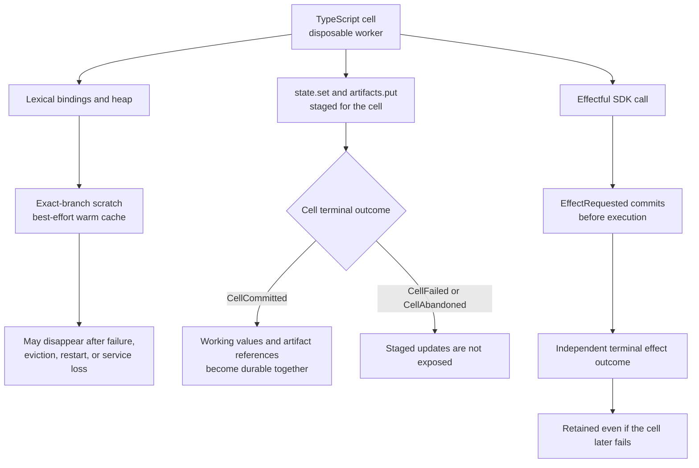

# Generated TypeScript console SDK

Agencity's generated execution surface is a TypeScript cell. A cell is transpiled by Bun, wrapped as the body of an async function, and executed in a disposable worker process. The worker receives typed facades for durable state and effects; it does not receive a storage client or provider credentials.

This reference describes the model-facing cell environment and its private supervisor/worker boundary. External applications should use the [TypeScript integration API](./api.md) or [public client protocol](./protocol.md), not the worker RPC.

## Provider boundary versus cell environment

An autonomous model request exposes exactly two declaration-only provider tools: `bun_console` and `finish`. Those tools have no execute callbacks and do not expose the SDK to the provider. An accepted `bun_console` call proposes source text; Agencity validates and durably commits the canonical action before creating the disposable cell described below.

The injected names in this document—`tools`, `sql`, `scratch`, `state`, `cells`, `artifacts`, `ai`, `sdk`, memory, agents, skills, goals, and related facades—exist only inside that later cell. They are not provider tools. Provider narration cannot invoke them, and Agencity has no assistant-text JSON or fenced-code fallback.

## Execution model

A cell can use top-level `await` and is evaluated like an async notebook cell:

```ts
const rows = await sql`
  SELECT type, count(*) AS occurrences
  FROM events
  WHERE session_id = ${session.id}
  GROUP BY type
`;

rows.slice(0, 5)
```

If the cell has no cell-level `return`, its last top-level expression becomes the observation and is awaited when it is a promise. An explicit cell-level `return` keeps normal early-return behavior. A `return` inside a nested function does not suppress final-expression observation. A cell ending in a declaration observes `null`.

Cells on one branch are serialized. The worker heap is disposable and can be restarted after every committed cell without changing durable semantics. Exact-session-and-branch scratch is a best-effort acceleration layer, not part of those semantics.

## Injected names

Every cell receives:

| Name | Value |
|---|---|
| `session` | `{ id, branchId }` for the executing branch. |
| `scratch` | Direct exact-branch object for replaceable cross-cell intermediates. |
| `state` | Durable typed working values: `restored`, `get`, `set`, and `list`. |
| `cells` | Retained cell history: `list` and `get`. |
| `artifacts` | Scoped content-addressed artifacts: `put` and bounded `readRange`. |
| `tools` | Outbox-backed generic effects plus shell and file helpers. |
| `sql` | Parameterized read-only tagged template. |
| `inspect` | Bounded, getter-free, redacting preview function. |
| `ai` | Durable one-request raw text and declared-object generation. |
| `sdk` | Namespaced access to the surfaces above, including `scratch.status/clear`, plus memory, harness, skills, specifications, agents, goals, heartbeats, schedules, and context. |
| `console` | Cell-local `log`, `warn`, and `error`; output becomes bounded cell logs. |

The direct `state`, `cells`, `artifacts`, `tools`, `inspect`, and `ai` names are the same implementations exposed under `sdk`. `scratch` is the direct object; its controls are `sdk.scratch`. `sql` and `session` are direct cell parameters rather than `sdk` properties.

## Durability rules

Durable identity lives in events, typed working values, artifacts, tasks, mailboxes, and model handles. JavaScript heap state and scratch do not.



- Lexical bindings are cell-local. Module instances, closures, sockets, subprocess handles, and `globalThis` changes disappear with the worker.
- `scratch` may preserve ordinary runtime values across nearby successful cells while one exact branch scope remains warm. The managed file-local product also attempts a bounded same-device JSON checkpoint after a successful cell; this does not make scratch durable.
- `state.set` stages JSON working values for atomic commit with the cell.
- `artifacts.put` stages an immutable artifact reference for atomic registration with the cell.
- Most effectful SDK calls commit their own outbox or domain events as they occur. A later cell failure does not erase an already committed external effect.
- Only a successful cell terminal batch exposes staged working values and artifact registrations.
- A failed or interrupted cell receives `CellFailed` or recovery-time `CellAbandoned`; its heap is never replayed.

Use local variables inside one cell, `scratch` for replaceable nearby intermediates, `state` for small values required after recovery, and artifacts for larger or byte-oriented durable content. Store durable handle IDs, not convenience functions. End each cell with only the focused observation needed by the next decision.

## `scratch`

```ts
const output = await tools.shell("rg --files");
scratch.files = output.completeness === "inline"
  ? output.value.stdout.split("\n").filter(Boolean)
  : [];
scratch.normalize = (value: string) => value.trim();

return { fileCount: scratch.files.length };
```

Later cells on the same exact session and branch can read the same object while its worker scope remains warm. Values may include functions, classes, cyclic objects, parsed documents, and module objects. Do not retain cell-scoped SDK facades, long-lived clients, timers, streams, sockets, subprocesses, or the only copy of required evidence. Scratch has a null prototype, permits at most 64 own string properties, limits keys to 128 UTF-8 bytes, and rejects symbols, accessors, non-configurable properties, extension locks, and prototype-pollution names so `sdk.scratch.clear()` can always empty the scope. It does not cross branch forks, parent, child, or sibling sessions, devices, or placements; transfer values explicitly through delegation inputs, durable messages, or artifacts.

After each successful committed cell, the supervisor checks whether scratch was changed. Clean scopes skip serialization and checkpoint storage. Top-level writes and deletes mark the scope dirty; reading a mutable value also marks it potentially dirty so nested changes such as `scratch.index.files.push(...)` are not missed. Dirty scopes receive a getter-free, 500 ms bounded checkpoint attempt. Eligible top-level properties are finite acyclic plain JSON, independently limited to 128 KiB and 256 KiB total with bounded depth/node/property counts. Unsupported, cyclic, accessor-backed, oversized, or secret-rejected siblings are recorded as skipped without hiding eligible values. Checkpoint failure never changes the committed cell result.

The ordinary managed product enables fenced checkpoints only for an exact file-local workspace database. It keeps at most 64 branch rows and 16 MiB per workspace, expires rows after seven days, and may evict them earlier. A new worker on the same device and exact branch may restore an eligible checkpoint. Embedded diagnostic supervisors and remote relational placements are warm-only unless an embedding host explicitly supplies its own checkpoint hooks.

Use `await sdk.scratch.status()` for bounded names, shallow types, temperature (`warm`, `restored`, or `cold`), checkpoint metadata, skipped reasons, cache availability, and limits. It never returns values. `await sdk.scratch.clear()` clears the live scope; the next successful checkpoint removes the retained cache row. A known skipped property throws `ScratchBindingUnavailableError` on direct read after restore. Rebuild it from durable inputs instead of replaying a prior cell that may have caused non-idempotent effects.

Scratch is noncanonical. It is excluded from events, state projections, synchronization, export, branch lineage, automatic context, completion gates, and completion evidence. Warm scratch and the console worker are not managed-service keep-alive reasons.

## `state`

```ts
const stored = await state.set("plan", {
  step: 2,
  done: false,
});

const restored = await state.get("plan");
const inventory = await state.list();
return { stored, restored, inventory };
```

`state.set(name, value)` accepts finite, acyclic, plain JSON. Names match `[A-Za-z_][A-Za-z0-9_.-]{0,127}`. Known brokered secret values are rejected.

At or below 128 KiB after serialization, a value is retained as `{ kind: "json", value }`. Larger JSON is written to the artifact store and retained as `{ kind: "artifact", artifactId }`. Each committed name receives a monotonically increasing version.

`state.restored` is the branch's working-value view captured at cell start. `state.get` includes this cell's staged updates. `state.list` returns name, version, handle, `committed` or `staged` status, and event provenance. It does not resolve artifact-backed values.

Each committed write appends retained history, including overwrites across cells; there is no ordinary state-delete operation. Keep a small stable key set, checkpoint only meaningful recovery boundaries, and do not copy temporary caches, repeated summaries, raw tool output, or values already available through retained cells into state.

## `cells`

```ts
const recent = await cells.list({
  limit: 20,
  status: ["committed", "failed"],
});
const prior = recent.items[0]
  ? await cells.get(recent.items[0].cellId)
  : null;
```

`cells.list({ limit?, status?, beforeCursor? })` is newest-first and cursor-paginated. The default statuses are committed, failed, and abandoned; the maximum page size is 100. `cells.get(cellId)` returns `null` outside the current branch lineage.

Entries include retained source, observation, logs, status, dependencies, attempts, duration, exports or error, and proposed/start/terminal event provenance. Reading history never replays code or effects.

## Observations, artifact spill, and logs

Cell observations must be safe JSON. `undefined` becomes `null`. Finite primitives, arrays, and plain objects are encoded without invoking accessors. Circular values, bigint, functions, class-backed objects, getters, and other unsupported values commit:

```json
{
  "kind": "unsupported",
  "reason": "Value at $ is not JSON serializable (bigint)",
  "preview": {
    "kind": "inspect",
    "preview": "\"[BigInt 1]\"",
    "truncated": false,
    "redacted": 0,
    "omittedGetters": 0,
    "limits": {
      "depth": 4,
      "entries": 50,
      "lines": 40,
      "bytes": 8192,
      "getters": 0
    }
  }
}
```

JSON observations at or below 128 KiB cross worker IPC and commit directly. Larger serializable observations are incrementally validated, scrubbed, staged in owner-only storage, placed in the content-addressed store, and committed as `agencity.bounded-output.v1`:

```json
{
  "protocol": "agencity.bounded-output.v1",
  "completeness": "spilled",
  "byteLength": 200000,
  "preview": {
    "kind": "inspect",
    "preview": "...",
    "truncated": true,
    "redacted": 0,
    "omittedGetters": 0,
    "limits": {
      "depth": 4,
      "entries": 50,
      "lines": 40,
      "bytes": 8192,
      "getters": 0
    }
  },
  "artifact": {
    "artifactId": "sha256:...",
    "digest": "...",
    "mediaType": "application/json",
    "size": 200000
  },
  "guidance": "Use artifacts.readRange(artifactId, start, end) to retrieve exact JSON bytes in bounded ranges and parse them inside a cell."
}
```

Each staging chunk is at most 64 KiB. Registration of the staged artifact and `CellCommitted` is one canonical append batch. A failed or abandoned cell exposes no staged reference; unreachable CAS bytes may remain because general artifact garbage collection is unavailable. Byte-identical content deduplicates by digest.

`console.log` and `process.stdout.write` become stdout cell logs. `console.warn`, `console.error`, and `process.stderr.write` become stderr cell logs. The retained terminal event keeps aligned stream metadata so clients can distinguish the two without changing the public `logs: string[]` result. Older events without this optional metadata project their logs as stdout. Logs are capped at 64 KiB and 1,000 entries. They are not protocol messages and cannot spoof worker RPC.

## `inspect`

```ts
inspect(value, {
  depth: 4,
  entries: 50,
  lines: 40,
  bytes: 8192,
  redact: ["internalField"],
});
```

`inspect` returns `{ kind: "inspect", preview, truncated, redacted, omittedGetters, limits }`. Defaults are depth 4, 50 visited entries, 40 lines, and 8 KiB. Hard maxima are depth 8, 200 entries, 100 lines, and 16 KiB.

Getters are never invoked. Circular values and exhausted limits receive markers. Credential-shaped property names and up to 32 caller-supplied exact property names are redacted. A preview is deliberately lossy and is not authoritative artifact content.

## `artifacts`

```ts
const reference = await artifacts.put(
  "large body",
  "text/plain",
);
const first = await artifacts.readRange(
  reference.artifactId,
  0,
  Math.min(reference.size, 64 * 1024),
);
if (first.completeness !== "inline") throw new Error("range unavailable");
const text = new TextDecoder().decode(first.value.bytes);
```

`put(content, mediaType?)` accepts strings, rejects known brokered secret values, and returns an immutable `ArtifactReference`. `readRange(artifactId, start, end)` can read only artifacts already registered in the branch or staged by the current cell. Ranges are zero-based, half-open `[start, end)`, and limited to 64 KiB. The inline envelope's `value` contains exact `Uint8Array` bytes plus `start`, `end`, immutable `size`, and `nextStart`. Decode or parse `value.bytes` inside the cell. Reads verify the complete object's digest and size before returning the requested bytes.

Whole-object `resolve` remains an operator/internal artifact-store operation and is not exposed to generated cells. The default product uses a local CAS. A remote S3-compatible placement adapter also implements range reads, but artifact replication and garbage collection are not automatic.

## `tools`

```ts
const shell = await tools.shell("bun test", {
  timeoutMs: 120_000,
  idempotencyKey: "test-v1",
});
if (shell.completeness === "inline") {
  if (shell.value.exitCode !== 0) throw new Error("tests failed");
} else {
  return {
    completeness: shell.completeness,
    preview: shell.preview,
    artifact: shell.completeness === "spilled" ? shell.artifact : null,
  };
}

const file = await tools.readFile("package.json", {
  startLine: 1,
  endLine: 200,
});
if (file.completeness !== "inline") return file;
await tools.writeFile(
  "notes/result.txt",
  `${file.value.content}\nreviewed\n`,
  file.value.sha256,
);

const outcome = await tools.request(
  "file",
  "delete",
  { path: "notes/obsolete.txt" },
  {
    idempotencyKey: "delete-obsolete-v1",
    idempotent: true,
  },
);
```

`tools.request(executor, operation, input, options?)` commits `EffectRequested` before execution and returns `{ outcome, output?, error? }`, where outcome is `succeeded`, `failed`, `cancelled`, or `unknown`.

`tools.shell` and `tools.readFile` return `agencity.bounded-output.v1`. Inspect `completeness` before reading `.value`:

- `inline` has the complete `.value`;
- `spilled` has a bounded `.preview`, immutable `.artifact`, exact `byteLength`, and recovery guidance;
- `truncated` has a bounded `.preview`, exact observed `byteLength`, reason, and guidance, but no complete artifact; and
- `refused` means a declared preflight limit prevented retrieval.

The convenience helpers return structured output:

- `tools.readFile(path, { startLine?, endLine?, expectedSha256? })` returns an inline envelope whose value is `{ content, startLine, endLine, totalLines, nextLine, sha256, size }`, or a refused envelope. Pages use one-based inclusive line windows, default to at most 2,000 lines, and are limited to 2 KiB per line and 48 KiB total. Supply the prior page's `sha256` as `expectedSha256` so continuation fails visibly if the mutable file changed.
- `tools.writeFile(path, content, expectedSha256?)` returns `{ path, sha256, size, unchanged? }`. Pass the digest from a prior read when replacing that exact version.
- `tools.shell(command, options?)` returns an inline envelope with `{ exitCode, stdout, stderr }` when each stream fits 24 KiB. Larger output keeps a Unicode-safe 12 KiB head and 12 KiB tail per stream and, when local staging is available and total output is at most 32 MiB, returns `spilled` with exact combined scrubbed bytes and stdout/stderr byte layout. Spill limit, failure, or unavailable staging returns explicit `truncated` without an artifact. Supported execution options include `timeoutMs` and `cwd`; the timeout key is not `timeout`.

`tools.shell`, `tools.readFile`, and `tools.writeFile` throw unless the outcome is `succeeded`. Use `tools.request` when an expected failed outcome must be inspected without failing the cell. Shell defaults to non-idempotent. File operations default to idempotent except exact-text replace. The flag is a caller assertion about logical effect semantics, not proof that an external system is safe to retry.

The file executor constrains typed file operations to its configured root and checks symlink escapes. The shell executor constrains only its initial working directory. Generated TypeScript and shell commands retain ambient OS authority.

### Repository instructions

The workspace-root `AGENTS.md` is loaded independently of a cell. A successful typed file read discovers regular `AGENTS.md` files in the target's ancestor directories. The runtime retains up to four changed files per read in root-to-nearest order and records their path, directory, precedence, exact source digest, size, completeness, and bounded content with `CellCommitted`. The active context keeps the latest discovered version per path; unchanged path/digest pairs are not recorded again after restart or branch replay. Changed or removed ancestors outside the four-file delivery window become pending references until a later read delivers them.

Root content is capped at 64 KiB. Nested files are capped at 16 KiB each, each automatic digest scan stops at 256 KiB, and one read scans at most 64 ancestor files. A cell retains at most 16 discovery groups; further groups commit counted, bounded omission metadata instead of disappearing. Active nested inline content is capped at 40 KiB across at most 64 records. Content beyond a limit becomes a reference or unavailable record with explicit `tools.readFile` guidance. Symlinks, non-regular files, invalid UTF-8, and files that change during loading are not executed or silently accepted. Direct Bun and shell reads do not trigger nested discovery.

These files are model-facing behavioral guidance, not runtime policy. They cannot widen permissions, budgets, provider access, completion rules, or refinement-review authority.

## `sql`

```ts
const failures = await sql`
  SELECT type, count(*) AS occurrences
  FROM events
  WHERE session_id = ${session.id}
  GROUP BY type
`;
```

Interpolations become bound parameters. The validator accepts one `SELECT`, `WITH` read, `EXPLAIN SELECT/WITH`, or a narrow metadata pragma. It rejects mutation, DDL, transactions, multiple statements, dangerous file/extension functions, private operational tables, and SQLite schema/engine tables.

Queries use a query-only connection with a 64 KiB statement limit, 1,000-row limit, and 2-second deadline.

This is a trusted-local analytical guard, not a hostile-input security boundary or confidentiality boundary. Raw SQL can inspect shared non-private projections beyond the scope-filtered model views. Deployments requiring tenant or candidate secrecy must isolate databases/processes or remove generated SQL.

## `sdk.memory`

```ts
await sdk.memory.create({
  name: "release-policy",
  text: "Use a canary before release",
  memoryKind: "constraint",
  evidenceEventIds: [sourceEventId],
});

const result = await sdk.memory.search(
  "release",
  { scopes: ["local", "workspace"], limit: 20 },
);
const visible = await sdk.memory.list();
```

Methods:

- `search(query, options?)`
- `create(input | string)`
- `list(options?)`

Agent-created memory is local-only and requires source-trajectory evidence. Broader changes use governed harness proposals. Retrieval returns attributable candidates, policy rejections, and selections.

## `sdk.harness`

Methods:

- `review(instructions | { instructions?, requestedScope?, allowedKinds?, wait? })` starts an attributable trajectory review;
- `reviews(options?)` lists retained review records for the branch;
- `propose(input)` submits an agent-authority proposal;
- `list(options?)` returns the scope-filtered model view;
- `history(entryId)` returns authorized version history.

The model view includes active entries authorized for the local/workspace/user/global scope plus candidate versions from the branch's exact exposed allocation. Unexposed candidates are omitted from these facades.

`allowedKinds` accepts `memory`, `prompt_note`, `skill`, and `subagent_spec` and restricts the formal proposal schema for that review. The string form remains shorthand for `{ instructions }`. The SDK retains the runtime API's wait-by-default behavior unless `wait: false` is explicit.

`review()` uses a supervisor-selected sealed recursive response contract with exactly one fully typed `agencity_submit_refinement_review` provider tool. The structured child result is retained without an assistant result message and is bound to the exact child model completion. This sealed recursive path is internal and does not expose a public recursive-model console API.

`review()` is the ordinary trajectory-to-governance entrypoint: a durable proposer may return no change or one typed candidate, which then enters deterministic validation, a separate sealed reviewer, application-time revalidation, automatic application, and exact terminal delivery. `propose(input)` retains the ADR-0002 direct candidate API for advanced and legacy-compatible use; it is not the ordinary activation path. Generated code cannot choose either reviewer, approve its own content, widen scope, record owner authority, or use legacy evaluator operations as a shortcut around governance.

## `sdk.skills`

Methods:

- `list({ includeUnavailable? })`
- `get(nameOrId)`
- `invoke(nameOrId, input, options?)`
- `test(nameOrId)`
- `propose(instructions, "local" | "workspace")`

Invocations and tests use immutable versions and durable outbox effects. A configured skill permission allowlist is checked during validation, testing, activation, and invocation. Skill permissions are admission policy, not OS isolation.

Generated code cannot import, install, enable, disable, or remove skills. Those are user/client management operations.

## `sdk.specs`

`sdk.specs.spawn(entryId, input?)` admits a version-pinned reusable subagent specification through the normal task/session model. The returned handle contains durable task, child, and version identity.

## `sdk.agents`

```ts
const child = await sdk.agents.spawn({
  task: "Inspect the first failure",
  completionCriteria: "Return root cause and evidence",
  name: "investigator",
  profile: {
    role: "Test investigator",
    purpose: "Investigate the admitted failing test.",
    instructions: "- Stay within the admitted task.\n- Return attributable evidence.",
  },
});

await sdk.agents.send({
  target: child.sessionId,
  content: "Prioritize the stack trace",
  taskId: child.taskId,
});

const family = await sdk.agents.list();
const page = await sdk.agents.messages({ limit: 20 });

const current = await sdk.agents.get();
const proposal = await sdk.agents.proposeProfileUpdate(undefined, {
  expectedProfileVersionId: current.profileVersionId,
  replacement: {
    role: "Repository investigator",
    purpose: "Investigate repository failures.",
    instructions: "Preserve attributable evidence.",
  },
  reason: "Clarify standing behavior",
  predictedEffect: "More consistent investigations",
  evidenceEventIds: [],
}, { wait: true });
```

Methods:

- `spawn(input | taskString)`
- `spawnMany(inputs)`
- `get(target?)`
- `proposeProfileUpdate(target, input, { wait? })`
- `rollbackProfile(target, { expectedCurrentVersionId, restoreVersionId, reason, evidenceEventIds })`
- `list()`
- `send(input)` or `send(target, content)`
- `messages(options?)`
- `acknowledge(messageId)`
- `cancel(target, reason?)`
- `followUp(target, content, options?)`

`list()` returns the same additive family projection as the public protocol. Every row includes exact session and branch identity, relationship, name, depth, session and task status, task summary, model configuration, cancellation-request state, derived activity, and a bounded activity reason. Direct children are scoped to task edges admitted from the executing branch. An admitted child without an active run is idle. Parent activity reflects the parent route, while the retained task fields describe the edge that relates the current child to that parent. Missing required state is returned as `unavailable` with `missing_state`; it is not omitted or redirected.

The executing session and branch always supply sender identity. Targets are limited to the unique parent, direct children, or siblings; deeper and cross-root targets are rejected. The literal `parent` selects the unique parent. Ambiguous names fail.

Messages are non-empty UTF-8 strings capped at 32 KiB. They may carry one authorized task reference and up to eight sender-registered artifact IDs. Intent keys provide stable deduplication. Rate and pending-queue bounds are enforced. Receipts distinguish queued, delivered to context, acknowledged, and failed.

`spawn` runs the child by default; `{ run: false }` admits without immediate runnable execution. `profile: { role, purpose, instructions }` supplies the child's complete initial standing behavior. Omitting it uses the sealed task-specialist profile. The profile is committed atomically with child admission and participates in idempotency checks. `followUp` reuses an idle or stopped retained child session and schedules a normal durable run.

`get()` without a target returns the executing agent's full active profile; a permitted direct-child target returns that child's profile. Proposal targets are limited to self or a direct creation-family child. The executing session and branch supply proposer identity, so generated code cannot spoof owner authority, another relationship, or evidence origin.

`proposeProfileUpdate` records the expected version, replacement, reason, predicted effect, evidence, and optional `revisesProposalId`. With `wait: true` it resolves at a terminal governance status. With `wait: false` it returns after durable admission and the exact result is later delivered to the origin route. The separate reviewer uses the route's current model and frozen product constitution/policy; workspace charter and user constraints are unavailable and pinned as `null`. The caller cannot choose the reviewer. Approval establishes policy consistency, not outcome proof.

`rollbackProfile` accepts only an exact earlier approved version of the same target and current-version compare-and-swap. It creates a new immutable restoration version; any content change requires a new reviewed proposal. Siblings, unrelated agents, and cross-root targets are rejected.

## `ai` and `sdk.ai`

```ts
const summary = await ai.generateText({
  prompt: "Summarize these sources",
  context: [
    { kind: "artifact", artifactId },
    { kind: "event", eventId },
  ],
  idempotencyKey: "summary-v1",
});

const parsed = await sdk.ai.generateObject({
  messages: [{ role: "user", content: "Extract the title and confidence." }],
  schema: z.object({
    title: z.string().max(200),
    confidence: z.number().min(0).max(1),
  }),
  budget: { tokenLimit: 2_000, wallTimeLimitMs: 30_000 },
  idempotencyKey: "extract-v1",
});
```

Methods:

- `generateText(input)`
- `generateObject({ ...input, schema })`

Exactly one of `prompt` or `messages` is required. `context` may contain bounded inline JSON or attributable artifact ranges, document ranges, events, memories, and read-only SQL rows. The worker converts supported Zod schemas to plain JSON Schema; the supervisor validates the restricted schema again before provider admission.

Each call freezes only the explicitly supplied prompt/messages and context. It does not add branch messages, profiles, retrieved memory, repository instructions, skills, or autonomous-agent context. Raw generation makes exactly one provider request and creates no child session, task, profile, mailbox, or family relationship.

The result remains inline and below the configured hard byte limit; oversized text or object output fails instead of spilling or changing type. Model selection and budgets may only narrow caller authority. Admission, provider input, schema, result, usage, cancellation, timeout, and unknown recovery remain durable. The public console does not expose `rlm` or `sdk.rlm`; retained recursive-model operations remain internal for existing sealed workflows and historical recovery.

## `sdk.goals`

Methods:

- `current()`
- `list()`
- `get(goalId)`
- `evaluations(goalId, gateId?)`

The generated facade is read-only. User-owned goals and completion decisions remain authoritative. Gate reads are restricted to the executing session/branch.

## `sdk.heartbeats`

Methods:

- `create(input | intervalMs)`
- `list()`
- `pause(heartbeatId, reason?)`
- `resume(heartbeatId, nextTickAt?)`
- `clear(heartbeatId, reason?)`

Generated code can see and manage only agent-owned heartbeats in the executing branch. It cannot mutate user-owned heartbeat records.

## `sdk.schedules`

Methods:

- `create({ prompt, at?, nextTickAt?, intervalMs?, goalMode? })`
- `list()`
- `wakes(statuses?)`
- `pause(scheduleId, reason?)`
- `resume(scheduleId, nextTickAt?)`
- `clear(scheduleId, reason?)`

Generated code can see and manage only agent-owned schedules and their schedule-origin wakes in the executing branch. User-owned schedules remain outside this authority.

## `sdk.context`

```ts
const before = await sdk.context.inspect();
const compacted = await sdk.context.compact({
  strategy: "deterministic-extractive-v1",
  idempotencyKey: "compact-v1",
});
```

`inspect()` returns the effective context summary and exact provenance. `compact(options?)` creates a retained derived context with agent-request attribution. Strategies are `deterministic-extractive-v1` and `model-summary-v1`. Source events remain canonical and are not deleted.

## Private worker boundary

The supervisor and worker exchange structured messages over Bun's dedicated IPC channel. Each cell has an `executionId`; each SDK call has a separate `requestId`, allowing concurrent SDK promises to route correctly. Only the supervisor touches storage, artifacts, executors, provider credentials, and canonical services.

Stdout and stderr are drained or captured as logs and are never parsed as RPC. Cells are serialized inside one worker because process output streams are global. A worker exit rejects pending cells; startup recovery records incomplete cells as abandoned and reconciles their already-durable effects separately.

This IPC shape is private implementation detail. It is not versioned for external worker implementations and must not be used as a client protocol.

## Authority and security summary

- Generated code cannot write canonical tables directly.
- SQL is read-only but shared and non-confidential inside trusted-local mode.
- State and artifact registration are branch-scoped and atomic with successful cell commit.
- External effects use the durable outbox.
- Memory, harness, skill, specification, agent, goal, and schedule services enforce scope and authority in the supervisor.
- Provider keys are stripped from the worker environment and brokered by the supervisor, but ambient OS access can still expose files or other resources available to the runtime user.
- The worker is not a hostile-code sandbox.

See [Trusted-local security boundary](./security.md) and [Crash recovery and unknown effects](./recovery.md) before exposing generated execution in another environment.
