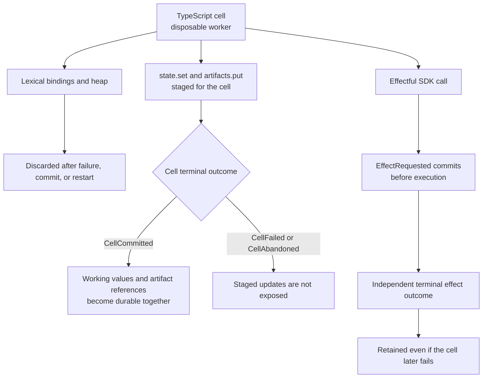

# Generated TypeScript console SDK

Agencity's generated execution surface is a TypeScript cell. A cell is transpiled by Bun, wrapped as the body of an async function, and executed in a disposable worker process. The worker receives typed facades for durable state and effects; it does not receive a storage client or provider credentials.

This reference describes the model-facing cell environment and its private supervisor/worker boundary. External applications should use the [TypeScript integration API](./api.md) or [public client protocol](./protocol.md), not the worker RPC.

## Provider boundary versus cell environment

An autonomous model request exposes exactly two declaration-only provider tools: `bun_console` and `finish`. Those tools have no execute callbacks and do not expose the SDK to the provider. An accepted `bun_console` call proposes source text; Agencity validates and durably commits the canonical action before creating the disposable cell described below.

The injected names in this document—`tools`, `sql`, `state`, `cells`, `artifacts`, `rlm`, `sdk`, memory, agents, skills, goals, and related facades—exist only inside that later cell. They are not provider tools. Provider narration cannot invoke them, and Agencity has no assistant-text JSON or fenced-code fallback.

## Execution model

A cell can use top-level `await` and is evaluated like an async notebook cell:

```ts
const rows = await sql`
  SELECT type, count(*) AS occurrences
  FROM events
  WHERE session_id = ${session.id}
  GROUP BY type
`;

rows.slice(0, 5)
```

If the cell has no cell-level `return`, its last top-level expression becomes the observation and is awaited when it is a promise. An explicit cell-level `return` keeps normal early-return behavior. A `return` inside a nested function does not suppress final-expression observation. A cell ending in a declaration observes `null`.

Cells on one branch are serialized. The worker heap is disposable and can be restarted after every committed cell without changing durable semantics.

## Injected names

Every cell receives:

| Name | Value |
|---|---|
| `session` | `{ id, branchId }` for the executing branch. |
| `state` | Durable typed working values: `restored`, `get`, `set`, and `list`. |
| `cells` | Retained cell history: `list` and `get`. |
| `artifacts` | Scoped content-addressed text artifacts: `put` and `get`. |
| `tools` | Outbox-backed generic effects plus shell and file helpers. |
| `sql` | Parameterized read-only tagged template. |
| `inspect` | Bounded, getter-free, redacting preview function. |
| `rlm` | Durable recursive-model calls. |
| `sdk` | Namespaced access to the surfaces above plus memory, harness, skills, specifications, agents, goals, heartbeats, schedules, and context. |
| `console` | Cell-local `log`, `warn`, and `error`; output becomes bounded cell logs. |

The direct `state`, `cells`, `artifacts`, `tools`, `inspect`, and `rlm` names are the same implementations exposed under `sdk`. `sql` and `session` are direct cell parameters rather than `sdk` properties.

## Durability rules

Durable identity lives in events, typed working values, artifacts, tasks, mailboxes, and model handles. JavaScript heap state does not.



- Lexical bindings, module instances, closures, sockets, subprocess handles, and `globalThis` changes disappear with the worker.
- `state.set` stages JSON working values for atomic commit with the cell.
- `artifacts.put` stages an immutable artifact reference for atomic registration with the cell.
- Most effectful SDK calls commit their own outbox or domain events as they occur. A later cell failure does not erase an already committed external effect.
- Only a successful cell terminal batch exposes staged working values and artifact registrations.
- A failed or interrupted cell receives `CellFailed` or recovery-time `CellAbandoned`; its heap is never replayed.

Use `state` for small structured values and artifacts for larger or byte-oriented content. Store durable handle IDs, not convenience functions.

## `state`

```ts
const stored = await state.set("plan", {
  step: 2,
  done: false,
});

const restored = await state.get("plan");
const inventory = await state.list();
return { stored, restored, inventory };
```

`state.set(name, value)` accepts finite, acyclic, plain JSON. Names match `[A-Za-z_][A-Za-z0-9_.-]{0,127}`. Known brokered secret values are rejected.

At or below 128 KiB after serialization, a value is retained as `{ kind: "json", value }`. Larger JSON is written to the artifact store and retained as `{ kind: "artifact", artifactId }`. Each committed name receives a monotonically increasing version.

`state.restored` is the branch's working-value view captured at cell start. `state.get` includes this cell's staged updates. `state.list` returns name, version, handle, `committed` or `staged` status, and event provenance. It does not resolve artifact-backed values.

## `cells`

```ts
const recent = await cells.list({
  limit: 20,
  status: ["committed", "failed"],
});
const prior = recent.items[0]
  ? await cells.get(recent.items[0].cellId)
  : null;
```

`cells.list({ limit?, status?, beforeCursor? })` is newest-first and cursor-paginated. The default statuses are committed, failed, and abandoned; the maximum page size is 100. `cells.get(cellId)` returns `null` outside the current branch lineage.

Entries include retained source, observation, logs, status, dependencies, attempts, duration, exports or error, and proposed/start/terminal event provenance. Reading history never replays code or effects.

## Observations, artifact spill, and logs

Cell observations must be safe JSON. `undefined` becomes `null`. Finite primitives, arrays, and plain objects are encoded without invoking accessors. Circular values, bigint, functions, class-backed objects, getters, and other unsupported values commit:

```json
{
  "kind": "unsupported",
  "reason": "Value at $ is not JSON serializable (bigint)",
  "preview": {
    "kind": "inspect",
    "preview": "\"[BigInt 1]\"",
    "truncated": false,
    "redacted": 0,
    "omittedGetters": 0,
    "limits": {
      "depth": 4,
      "entries": 50,
      "lines": 40,
      "bytes": 8192,
      "getters": 0
    }
  }
}
```

JSON observations at or below 128 KiB commit directly. Larger serializable observations place the complete JSON in the content-addressed store and commit:

```json
{
  "kind": "oversized-json",
  "artifact": {
    "artifactId": "sha256:...",
    "digest": "...",
    "mediaType": "application/json",
    "size": 200000
  },
  "byteLength": 200000,
  "preview": {
    "kind": "inspect",
    "preview": "...",
    "truncated": true,
    "redacted": 0,
    "omittedGetters": 0,
    "limits": {
      "depth": 4,
      "entries": 50,
      "lines": 40,
      "bytes": 8192,
      "getters": 0
    }
  }
}
```

Byte-identical content deduplicates by digest.

`console.log` and `process.stdout.write` become stdout cell logs. `console.warn`, `console.error`, and `process.stderr.write` become stderr cell logs. The retained terminal event keeps aligned stream metadata so clients can distinguish the two without changing the public `logs: string[]` result. Older events without this optional metadata project their logs as stdout. Logs are capped at 64 KiB and 1,000 entries. They are not protocol messages and cannot spoof worker RPC.

## `inspect`

```ts
inspect(value, {
  depth: 4,
  entries: 50,
  lines: 40,
  bytes: 8192,
  redact: ["internalField"],
});
```

`inspect` returns `{ kind: "inspect", preview, truncated, redacted, omittedGetters, limits }`. Defaults are depth 4, 50 visited entries, 40 lines, and 8 KiB. Hard maxima are depth 8, 200 entries, 100 lines, and 16 KiB.

Getters are never invoked. Circular values and exhausted limits receive markers. Credential-shaped property names and up to 32 caller-supplied exact property names are redacted. A preview is deliberately lossy and is not authoritative artifact content.

## `artifacts`

```ts
const reference = await artifacts.put(
  "large body",
  "text/plain",
);
const body = await artifacts.get(reference.artifactId);
```

`put(content, mediaType?)` accepts strings, rejects known brokered secret values, and returns an immutable `ArtifactReference`. `get(artifactId)` can resolve only artifacts already registered in the branch or staged by the current cell. Reads verify digest and size through the configured artifact store.

The default product uses a local CAS. A remote S3-compatible placement adapter also implements the artifact contract, but artifact replication and garbage collection are not automatic.

## `tools`

```ts
const shell = await tools.shell("bun test", {
  timeoutMs: 120_000,
  idempotencyKey: "test-v1",
});

const file = await tools.readFile("package.json");
await tools.writeFile(
  "notes/result.txt",
  `${file.content}\nreviewed\n`,
  file.sha256,
);

const outcome = await tools.request(
  "file",
  "delete",
  { path: "notes/obsolete.txt" },
  {
    idempotencyKey: "delete-obsolete-v1",
    idempotent: true,
  },
);
```

`tools.request(executor, operation, input, options?)` commits `EffectRequested` before execution and returns `{ outcome, output?, error? }`, where outcome is `succeeded`, `failed`, `cancelled`, or `unknown`.

The convenience helpers return structured output:

- `tools.readFile(path)` returns `{ content, sha256, size }`. Read or edit `content`; the result itself is not a string.
- `tools.writeFile(path, content, expectedSha256?)` returns `{ path, sha256, size, unchanged? }`. Pass the digest from a prior read when replacing that exact version.
- `tools.shell(command, options?)` returns `{ exitCode, stdout, stderr, truncated }`. Supported execution options include `timeoutMs` and `cwd`; the timeout key is not `timeout`.

`tools.shell`, `tools.readFile`, and `tools.writeFile` throw unless the outcome is `succeeded`. Use `tools.request` when an expected failed outcome must be inspected without failing the cell. Shell defaults to non-idempotent. File operations default to idempotent except exact-text replace. The flag is a caller assertion about logical effect semantics, not proof that an external system is safe to retry.

The file executor constrains typed file operations to its configured root and checks symlink escapes. The shell executor constrains only its initial working directory. Generated TypeScript and shell commands retain ambient OS authority.

## `sql`

```ts
const failures = await sql`
  SELECT type, count(*) AS occurrences
  FROM events
  WHERE session_id = ${session.id}
  GROUP BY type
`;
```

Interpolations become bound parameters. The validator accepts one `SELECT`, `WITH` read, `EXPLAIN SELECT/WITH`, or a narrow metadata pragma. It rejects mutation, DDL, transactions, multiple statements, dangerous file/extension functions, private operational tables, and SQLite schema/engine tables.

Queries use a query-only connection with a 64 KiB statement limit, 1,000-row limit, and 2-second deadline.

This is a trusted-local analytical guard, not a hostile-input security boundary or confidentiality boundary. Raw SQL can inspect shared non-private projections beyond the scope-filtered model views. Deployments requiring tenant or candidate secrecy must isolate databases/processes or remove generated SQL.

## `sdk.memory`

```ts
await sdk.memory.create({
  name: "release-policy",
  text: "Use a canary before release",
  memoryKind: "constraint",
  evidenceEventIds: [sourceEventId],
});

const result = await sdk.memory.search(
  "release",
  { scopes: ["local", "workspace"], limit: 20 },
);
const visible = await sdk.memory.list();
```

Methods:

- `search(query, options?)`
- `create(input | string)`
- `list(options?)`

Agent-created memory is local-only and requires source-trajectory evidence. Broader changes use governed harness proposals. Retrieval returns attributable candidates, policy rejections, and selections.

## `sdk.harness`

Methods:

- `review(instructions?)` starts an attributable trajectory review;
- `reviews(options?)` lists retained review records for the branch;
- `propose(input)` submits an agent-authority proposal;
- `list(options?)` returns the scope-filtered model view;
- `history(entryId)` returns authorized version history.

The model view includes active entries authorized for the local/workspace/user/global scope plus candidate versions from the branch's exact exposed allocation. Unexposed candidates are omitted from these facades.

`review()` uses a supervisor-selected sealed recursive response contract with exactly one fully typed `agencity_submit_refinement_review` provider tool. The structured child result is retained without an assistant result message and is bound to the exact child model completion. This internal path does not change the public `rlm` methods below, which remain text-result calls.

Generated code cannot validate, activate, allocate, record evaluator observations, approve promotion, decide promotion, approve rollback, or perform rollback. Those operations remain evaluator/user-owned through the supervisor or public client.

## `sdk.skills`

Methods:

- `list({ includeUnavailable? })`
- `get(nameOrId)`
- `invoke(nameOrId, input, options?)`
- `test(nameOrId)`
- `propose(instructions, "local" | "workspace")`

Invocations and tests use immutable versions and durable outbox effects. A configured skill permission allowlist is checked during validation, testing, activation, and invocation. Skill permissions are admission policy, not OS isolation.

Generated code cannot import, install, enable, disable, or remove skills. Those are user/client management operations.

## `sdk.specs`

`sdk.specs.spawn(entryId, input?)` admits a version-pinned reusable subagent specification through the normal task/session model. The returned handle contains durable task, child, and version identity.

## `sdk.agents`

```ts
const child = await sdk.agents.spawn({
  task: "Inspect the first failure",
  completionCriteria: "Return root cause and evidence",
  name: "investigator",
});

await sdk.agents.send({
  target: child.sessionId,
  content: "Prioritize the stack trace",
  taskId: child.taskId,
});

const family = await sdk.agents.list();
const page = await sdk.agents.messages({ limit: 20 });
```

Methods:

- `spawn(input | taskString)`
- `list()`
- `send(input)` or `send(target, content)`
- `messages(options?)`
- `acknowledge(messageId)`
- `cancel(target, reason?)`
- `followUp(target, content, options?)`

`list()` returns the same additive family projection as the public protocol. Every row includes exact session and branch identity, relationship, name, depth, session and task status, task summary, model configuration, cancellation-request state, derived activity, and a bounded activity reason. Direct children are scoped to task edges admitted from the executing branch. An admitted child without an active run is idle. Parent activity reflects the parent route, while the retained task fields describe the edge that relates the current child to that parent. Missing required state is returned as `unavailable` with `missing_state`; it is not omitted or redirected.

The executing session and branch always supply sender identity. Targets are limited to the unique parent, direct children, or siblings; deeper and cross-root targets are rejected. The literal `parent` selects the unique parent. Ambiguous names fail.

Messages are non-empty UTF-8 strings capped at 32 KiB. They may carry one authorized task reference and up to eight sender-registered artifact IDs. Intent keys provide stable deduplication. Rate and pending-queue bounds are enforced. Receipts distinguish queued, delivered to context, acknowledged, and failed.

`spawn` runs the child by default; `{ run: false }` admits without immediate runnable execution. `followUp` reuses an idle or stopped retained child session and schedules a normal durable run.

## `rlm` and `sdk.rlm`

```ts
const handle = await rlm.start({
  prompt: "Summarize these sources",
  inputs: [
    { kind: "artifact", artifactId },
    { kind: "event", eventId },
  ],
  idempotencyKey: "summary-v1",
});

const result = await handle.result({
  wait: true,
  timeoutMs: 30_000,
});
```

Methods:

- `start(input | promptString)`
- `startMany(inputs)`
- `get(handleId | handle)`
- `result(handleId | handle, { wait?, timeoutMs? })`
- `cancel(handleId | handle, reason?)`

Inputs can contain inline JSON or attributable artifact ranges, document ranges, events, memories, SQL rows, and input-set IDs. Admission freezes input provenance and hash. Inline materialized input is bounded.

Returned handles contain durable parent/child/task/model/input/status identity. Convenience `result`, `cancel`, and `refresh` functions are non-enumerable, so serializing the handle preserves only JSON identity. Save `handleId` in working state when another worker must resolve it.

Handles are scoped to the executing parent session and branch. A child inherits the parent's model unless existing policy authorizes a narrower override; generated code cannot widen provider/model or budget authority. Lost non-idempotent model execution becomes terminal `unknown` and is not replayed.

## `sdk.goals`

Methods:

- `current()`
- `list()`
- `get(goalId)`
- `evaluations(goalId, gateId?)`

The generated facade is read-only. User-owned goals and completion decisions remain authoritative. Gate reads are restricted to the executing session/branch.

## `sdk.heartbeats`

Methods:

- `create(input | intervalMs)`
- `list()`
- `pause(heartbeatId, reason?)`
- `resume(heartbeatId, nextTickAt?)`
- `clear(heartbeatId, reason?)`

Generated code can see and manage only agent-owned heartbeats in the executing branch. It cannot mutate user-owned heartbeat records.

## `sdk.schedules`

Methods:

- `create({ prompt, at?, nextTickAt?, intervalMs?, goalMode? })`
- `list()`
- `wakes(statuses?)`
- `pause(scheduleId, reason?)`
- `resume(scheduleId, nextTickAt?)`
- `clear(scheduleId, reason?)`

Generated code can see and manage only agent-owned schedules and their schedule-origin wakes in the executing branch. User-owned schedules remain outside this authority.

## `sdk.context`

```ts
const before = await sdk.context.inspect();
const compacted = await sdk.context.compact({
  strategy: "deterministic-extractive-v1",
  idempotencyKey: "compact-v1",
});
```

`inspect()` returns the effective context summary and exact provenance. `compact(options?)` creates a retained derived context with agent-request attribution. Strategies are `deterministic-extractive-v1` and `model-summary-v1`. Source events remain canonical and are not deleted.

## Private worker boundary

The supervisor and worker exchange structured messages over Bun's dedicated IPC channel. Each cell has an `executionId`; each SDK call has a separate `requestId`, allowing concurrent SDK promises to route correctly. Only the supervisor touches storage, artifacts, executors, provider credentials, and canonical services.

Stdout and stderr are drained or captured as logs and are never parsed as RPC. Cells are serialized inside one worker because process output streams are global. A worker exit rejects pending cells; startup recovery records incomplete cells as abandoned and reconciles their already-durable effects separately.

This IPC shape is private implementation detail. It is not versioned for external worker implementations and must not be used as a client protocol.

## Authority and security summary

- Generated code cannot write canonical tables directly.
- SQL is read-only but shared and non-confidential inside trusted-local mode.
- State and artifact registration are branch-scoped and atomic with successful cell commit.
- External effects use the durable outbox.
- Memory, harness, skill, specification, agent, goal, and schedule services enforce scope and authority in the supervisor.
- Provider keys are stripped from the worker environment and brokered by the supervisor, but ambient OS access can still expose files or other resources available to the runtime user.
- The worker is not a hostile-code sandbox.

See [Trusted-local security boundary](./security.md) and [Crash recovery and unknown effects](./recovery.md) before exposing generated execution in another environment.
