# Event schemas (version 5)

`events` is the canonical append-only history. The runtime accepts schema version 5 only. Workspaces containing schema version 1, 2, 3, or 4 reject with reset guidance before product migration, row decoding, projection, synchronization ingestion, or recovery. They are not upcast or reinterpreted. After release, payload evolution requires a new schema version and an explicit tested projection path.

## Header

Every stored event has:

| Field | Type | Meaning |
|---|---|---|
| `cursor` | decimal string | Opaque, ordered local database cursor derived from `events.sequence`; compare as integer/`BigInt`, not JS `number`. |
| `id` | non-empty string | Globally unique event identity (normally ULID). Consumers deduplicate on this field. |
| `sessionId` | non-empty string | Owning session. |
| `branchId` | non-empty string | Branch where the event was appended. Lineage reads may also include ancestor-branch events. |
| `causationId` | string or `null` | Direct causal event when supplied. |
| `correlationId` | string or `null` | Cross-event operation correlation when supplied. |
| `type` | `EventType` | Payload discriminator listed below. |
| `schemaVersion` | positive integer | Payload/header version; exactly `5`. |
| `committedAt` | string (normally ISO datetime) | Commit timestamp supplied or generated at the storage boundary. |
| `producer` | non-empty string | Usually `supervisor`, `console`, `model`, `executor`, `client`, or `recovery`. |
| `idempotencyKey` | string or `null` | Unique within `(sessionId, type)` when present. Same payload/branch deduplicates; changed meaning conflicts. |
| `payload` | JSON value | Typed by `type` and validated before append. |
| `originDeviceId` | non-empty string | Stable profile device that first committed the event. |
| `originSequence` | positive safe integer | Monotonic sequence allocated by that origin device, independent of the local database cursor. |
| `streamParentId` | string or `null` | Previous event in the writer's source branch. Sync uses it for causal order and offline divergence detection. |

The relational columns use snake case and `payload_json`; TypeScript event objects use the camel-case fields above. Replication never treats `cursor` as portable. Immutable transport envelopes use `(originDeviceId, originSequence, id)`, `streamParentId`, explicit dependencies, and a SHA-256 digest; ingestion assigns a fresh local cursor after validation.

## Shared value schemas

```ts
type JsonValue = null | boolean | number | string | JsonValue[] |
  { [key: string]: JsonValue }; // finite numbers, plain acyclic objects

type EffectOutcome = "succeeded" | "failed" | "cancelled" | "unknown";
type SessionStatus = "idle" | "running" | "stopped" | "failed" | "archived";
type WorkingValue =
  | { kind: "json"; value: JsonValue }
  | { kind: "artifact"; artifactId: string };

type ArtifactReference = {
  artifactId: string; digest: string /* 64 lowercase hex */;
  mediaType: string; size: number /* nonnegative */;
};

type BoundedOutputV1<T, P = T> =
  | { protocol: "agencity.bounded-output.v1"; completeness: "inline";
      byteLength: number; value: T }
  | { protocol: "agencity.bounded-output.v1"; completeness: "spilled";
      byteLength: number; preview: P; artifact: ArtifactReference; guidance: string }
  | { protocol: "agencity.bounded-output.v1"; completeness: "truncated";
      byteLength: number; preview: P;
      reason: "spill-unavailable" | "spill-failed" | "spill-limit" | "observation-budget";
      guidance: string }
  | { protocol: "agencity.bounded-output.v1"; completeness: "refused";
      byteLength: 0; reason: string; guidance: string };

type Usage = {
  inputTokens: number; outputTokens: number; costUsd: number;
}; // all nonnegative

type AgentProfileVersion = {
  profileVersionId: string; agentSessionId: string; revision: number;
  role: string; purpose: string; instructions: string;
  exactAgentPrompt: string;
  promptContractId: "agencity.agent-profile.v1";
  promptDigest: string; // SHA-256 hex
  createdBy:
    | { kind: "user"; profileId: string }
    | { kind: "agent"; sessionId: string; branchId: string }
    | { kind: "system"; componentId: string; version: number };
  sourceSpecEntryId: string | null;
  sourceSpecVersionId: string | null;
  reason: string; evidenceEventIds: string[];
  supersedesProfileVersionId: string | null;
  restoresProfileVersionId: string | null;
  sourceProposalId: string | null;
  reviewDecisionId: string | null;
  createdAt: string;
};

type InvocationPromptProvenance = {
  invocationKind: "agent-run" | "recursive-model";
  invocationId: string;
  profileVersionId: string;
  agentPromptDigest: string;
  effectiveSystemPromptDigest: string;
  systemPromptContractId: "agencity.system-prompt.v1";
  components: {
    basePolicy: { componentId: string; version: number; digest: string };
    agentProfile: { componentId: string; version: number; digest: string };
    responseContract: { componentId: string; version: number; digest: string };
    executionGuidance: { componentId: string; version: number; digest: string };
  };
};
```

A model configuration has required non-empty `provider`, canonical `creator/model`, and `reasoningEffort`, with optional finite `temperature` and nonnegative `maxOutputTokens`. Reasoning effort is `provider-default`, `none`, `minimal`, `low`, `medium`, `high`, or `xhigh`. Budget limits optionally contain nonnegative `tokenLimit`, `costLimitUsd`, `turnLimit`, and `wallTimeLimitMs`.

## Payload registry

Optional fields are marked `?`. All IDs/names required by schema are non-empty strings unless a stricter note is shown.

| Event type | Version 5 payload | Projection/semantic effect |
|---|---|---|
| `SessionCreated` | `{ workspaceId, initialBranchId, model, budget, agentProfile, sessionName?, initialBranchName?, parentSessionId?, parentBranchId?, rootSessionId?, depth?, taskId? }` | Atomically initializes a root or normal child session and its complete revision-1 profile. Child creation requires the complete parent/root/depth/task tuple. The embedded profile retains exact rendered prompt, digest, creator, reason, and optional specification source; initial proposal/review/rollback provenance is null. |
| `AgentProfileVersionCreated` | `{ agentProfile, expectedActiveProfileVersionId }` | Retains a later immutable governed or restoration version after compare-and-swap against the session-wide active pointer. The event must use the session's initial branch. |
| `AgentProfileActivated` | `{ profileVersionId, expectedActiveProfileVersionId, reason }` | Moves the session-wide active pointer to an existing retained version after compare-and-swap. The event must use the session's initial branch; later invocations on any branch use the new pointer. |
| `BranchCreated` | `{ branchId, parentBranchId, forkCursor: decimal string, name?: string }` | Selects the new active branch projection. Storage records ancestry through the exact parent cursor. |
| `SessionNamed` | `{ name }` | Changes the human session label without changing durable identity or retained task text. Product listing resolves the latest attributable rename across retained branches. |
| `BranchNamed` | `{ name }` | Changes the current branch label; the rebuildable branch routing projection mirrors it. |
| `SessionStatusChanged` | `{ status: SessionStatus, reason?: string }` | Sets projected lifecycle status. |
| `SessionModelChanged` | `{ previousModel, model, selectedBy: "user" }` | Replaces the selected model for the current branch only when `previousModel` still matches and no model work is active. It is explicit user configuration, not workspace-material evidence. |
| `MessageAppended` | `{ messageId, role: "system" | "user" | "assistant" | "tool", content: string, modelCallId?: string, mailbox?: { mailboxMessageId, fromSessionId, relationship, taskId?, artifactIds?, receiptEventId }, learningScan?: { version: 1, category: "scan_unavailable" | "validation_failed" } }` | Appends one conversation message. Optional mailbox provenance links a family-delivered message to its exact sender and receipt. The reserved `learningScan` payload gives automatic-learning scan observations a typed, versioned category; projection never infers category from message prose. |
| `CellProposed` | `{ cellId, code: string, dependencies: string[] }` | Creates a proposed cell with attempt count zero. |
| `CellStarted` | `{ cellId, attempt: positive integer }` | Moves a proposed/running cell to running. |
| `CellCommitted` | `{ cellId, result: JsonValue, logs: string[], logStreams?: ("stdout" \| "stderr")[], durationMs: nonnegative number, exports: string[], repositoryInstructions?: RepositoryInstructionDiscovery[], repositoryInstructionOmission?: RepositoryInstructionOmission }` | Moves a running cell to committed. Optional stream metadata must align one-to-one with `logs`; older events without it project logs as stdout. A repository-instruction discovery retains the successful typed-read target, up to four unique root-to-nearest changed directory records, and counted bounded pending paths under `agencity.repository-instructions.v1`. A cell-level omission explicitly counts discovery-bearing reads and instruction records beyond the 16-group cell bound. Working/artifact events are committed in the same append batch. |
| `CellFailed` | `{ cellId, error: string, logs: string[], logStreams?: ("stdout" \| "stderr")[], durationMs: nonnegative number }` | Moves a running cell to failed; optional stream metadata follows the same alignment and compatibility rule, and no staged state/reference is appended. |
| `CellAbandoned` | `{ cellId, reason: string }` | Recovery terminal for proposed/running cell; never implies its effects did not happen. |
| `WorkingValueSet` | `{ name, version: positive integer, value: WorkingValue }` | Replaces active named value only when version increases. |
| `ArtifactRegistered` | `{ artifactId, digest, mediaType, size, sourceEventId?: string }` | Registers integrity metadata; bytes remain in the artifact store. |
| `EffectRequested` | `{ effectId, executor, operation, input: JsonValue, origin: EffectOrigin, idempotencyKey, idempotent: boolean }` | Canonical intent and source of a pending outbox projection. The closed origin union identifies a cell, model call, raw AI generation, compaction, goal gate, skill invocation/test, or runtime request before execution. Migration 019 stores the same origin in the outbox projection. |
| `EffectAttemptStarted` | `{ effectId, attempt: positive integer }` | Records an execution attempt and projects running status. |
| `EffectOutcomeRecorded` | `{ effectId, attempt: positive integer, outcome: EffectOutcome, output?: JsonValue, error?: string, modelFailure?: { code: ModelEffectFailureCode }, observedAt: ISO datetime }` | Canonical terminal observation. Unknown remains visibly distinct. A failed model effect retains the same closed failure code as `ModelCallTerminated.failureCode`. |
| `EffectReconciliationRecorded` | `{ reconciliationId, effectId, assessment: "succeeded" | "failed" | "no_effect" | "still_unknown", summary, evidence?: JsonValue, recordedBy, recordedAt }` | Append-only operator evidence for an already-unknown effect. It never changes effect/outbox status and never retries work. |
| `ContextCompactionRequested` | `{ compactionId, strategy, reason, requestedBy, instructions?, throughCursor, sourceEventIds, sourceDigest, frozenSources, capacity?, modelDispatch?, ancestorContextId?, rematerializedFromContextId? }` | Freezes the exact ordered narrative source envelopes, cursors, payloads, digest, and model dispatch before any model-summary effect. Requests never delete or rewrite their sources. |
| `ContextCompactionFailed` | `{ compactionId, requestEventId, strategy, outcome, error, effectId? }` | Makes failed, unknown, protected-only, and non-shrinking compaction terminal states explicit. Unknown model effects are not retried. |
| `ContextMaterialized` | `{ contextId, records, contentHash, context, harnessProvenance?, promptProvenance?, providerInputAdmission?, derivation? }` | Records exact retained context and provenance. Autonomous and recursive calls retain invocation kind/ID, profile version and prompt digest, effective-system-prompt digest, prompt contract, and immutable base/profile/response/guidance component references. `providerInputAdmission` pins the exact provider-input candidate version/digest, dispatch, and capacity so recovery can reconstruct and verify it. An optional typed compaction derivation names strategy, request, leaf/source digests, generation, capacity, effects, and usage. Also inserts immutable `context_records`. |
| `ModelCallRequested` | `{ callId, contextId, effectId, modelDispatch, providerInput, estimatedInputTokens, promptProvenance, attempt?, retryOfCallId?, contextWindow? }` | Links a logical model call or attributed overflow retry to exact context, immutable `agencity.model-dispatch.v2`, complete `agencity.provider-input.v1` candidate, estimate, capacity provenance, durable effect, and invocation prompt provenance. The candidate is the exact normalized messages, tool declarations, policies, token-relevant options, and provenance consumed by both estimation and execution. |
| `ModelOutputChunk` | `{ callId, sequence: nonnegative integer, text: string }` | Appends authoritative projected output for a text-result call. Text paths commit one sequence-0 chunk in the terminal success batch; live provider deltas and formal arguments are deliberately not this event. |
| `ModelCallCompleted` | `{ callId, responseMessageId?, result, resultDigest, termination, usage, warnings, usageSource }` | Marks model success and binds the response summary to the authoritative `agencity.model-effect-output.v2`. Text results may link an assistant message; formal submissions and violations retain only digest-linked summaries. |
| `ModelCallTerminated` | `{ callId, outcome: "failed" | "cancelled" | "unknown", error?, failureCode? }` | Visible non-success terminal state with a closed model-failure classification; no fabricated response. |
| `BudgetDebited` | `{ callId, tokens, costUsd, turns, wallTimeMs, usageSource }` (all nonnegative) | Adds provider-reported or conservative guard-estimate usage to projected counters. |
| `BudgetExceeded` | `{ dimension: "tokens" | "cost" | "turns" | "wallTime", limit: nonnegative, spent: nonnegative }` | Sets exceeded and idle; future turns reject. Boundary comparison is `>=`. |
| `RecoveryPerformed` | `{ abandonedCellIds: string[], unknownEffectIds: string[], retriedEffectIds: string[] }` | Audit evidence for a branch recovery pass; otherwise projection-neutral. |
| `TaskCreated` / `SubagentAdmitted` | Durable parent/task/child/model/budget intent, followed by matching admitted child IDs/time. | Creates a pending task then admits the already-created normal child session. |
| `TaskStatusChanged` / `SubagentCancellationRequested` | Task ID plus validated status/result/artifacts/error/reason or child cancellation intent. | Projects current task lifecycle without hiding cancellation intent; startup finishes recorded nonterminal cascades leaf-first and the first recorded reason wins retries. |
| `TaskUsageAttributed` | `{ taskId, childSessionId, tokens, costUsd, turns, wallTimeMs, conservative }` | Attributes a terminal child’s direct usage to each ancestor exactly once; unknown model usage consumes the unaccounted reservation conservatively. |
| `MailboxMessageSent` / `MailboxMessageDelivered` | Stable message/endpoints, bounded content, optional task/artifacts/intent, explicit `mode`, and reply link; delivery links `sentEventId` and derived sender relationship. Earlier schema-5 history may retain its delivery marker under the original `followUp` field name. | Commits one sender intent and accepted recipient mailbox row; same sender/branch intent is idempotent only when all durable meaning agrees. Public projections expose `mode: "steer" \| "queue"` and identify retained legacy follow-up rows without reinterpreting their busy-run delivery behavior. |
| `MailboxMessageContextDelivered` / `MailboxMessageDeliveryFailed` / `MailboxMessageAcknowledged` | Stable message/context event IDs, relationship, optional consuming run, failure, or recipient acknowledgement/time. | Advances the shared receipt through queued, context-delivered, failed, or acknowledged without inferring success; context delivery also links the provenance-bearing user message and exposes its optional `contextRunId`. |
| `TaskTerminalNoticeSent` / `TaskTerminalNoticeDelivered` | Stable notice/task/parent/child IDs, terminal status and optional result/artifacts/error/reason; delivery links send. | Makes child termination visible in both session histories. |
| `DocumentImported` / `DocumentChunkAdded` | Document metadata/digest/count and ordered chunk ID/content/size/digest. | Imports exact large-input rows without injecting all content into model context. |
| `InputSetCreated` | `{ inputSetId, name?, chunkIds, metadata? }` | Freezes an ordered set of exact chunk row IDs for delegation/model input. |
| `GoalCreated` / `GoalCompletionRequested` / `GoalStatusChanged` | Goal/criteria/bound, durable completion request with the retained compatibility cursor plus canonical `materialVersion`/material-event pins, and validated active/paused/completed/blocked transition. | Product runs explicitly select `auto`, `current`, or `create`; goal creation/attachment commits atomically with the run and assistant prose never completes it. |
| `GoalGateAdded` / `GoalGateStatusChanged` / `GoalGateEvaluationRecorded` | Typed executor request, transient status, and immutable terminal evaluation with definition hash, workspace-material version, source event IDs, output/error, and optional cached-evaluation link. | Required failures prevent completion. Matching definition/material pairs reuse retained evidence without executor admission; all historical/current/stale pins remain queryable. |
| `HeartbeatCreated` / `HeartbeatTicked` / `HeartbeatStatusChanged` | Interval/due time/goal/prompt/owner, monotonic coalesced tick timing, and active/paused/cancelled state. | Ticks atomically enqueue a durable wake; they do not call the diagnostic text loop. User-owned records cannot be changed by generated code. |
| `ScheduleCreated` / `ScheduleTicked` / `ScheduleStatusChanged` | One-time/interval prompt, explicit goal mode, due time, coalesced tick, owner, and lifecycle. | One-time schedules complete after one queued tick; recurring missed intervals coalesce into one wake. |
| `WakeQueued` / `WakeClaimed` / `WakeDelivered` / `WakeDeliveryUnknown` | Stable source/tick/wake identity, prompt/goal provenance, claim, AgentRun ID, and explicit uncertain delivery. | Delivery is claim-before-run through `AgentRunService`; stable IDs reconcile crashes without a second execution loop or blind prompt replay. |
| `RecursiveModelStarted` / `RecursiveModelStatusChanged` | Durable handle/task/parent/child/model/input-set IDs, exact `responseAdmission`, immutable `profilePin`, bounded materialized input plus identity provenance/hash, lifecycle status, distinct terminal outcome, and bounded result/artifact reference. | Retained history and private sealed workflows preserve recursive child semantics. The profile pin fixes the child profile version, prompt digest, and prompt contract for the whole invocation. Sealed structured children retain their exact response contract/capability seed and may complete with a typed message-free result bound to the child model completion. |
| `AiGenerationContextFrozen` | `{ generationId, context, provenance, contextDigest, exactUtf8Bytes }` | Freezes the exact ordered explicit values, attributable references, ranges, source digests, completeness, and omissions before raw model execution. |
| `AiGenerationRequested` | `{ generationId, kind, effectId, idempotencyKey, requestDigest, cellId?, runId?, taskId?, ancestorTaskIds, modelDispatch, providerInput, estimatedInputTokens, contextEventId, contextDigest, budget, reservation }` | Atomically admits one text or declared-object generation with its `EffectRequested`. It pins exact dispatch/provider input and reserves caller-owned token, cost, turn, and wall-time capacity without creating a child. |
| `AiGenerationStatusChanged` | `{ generationId, status, effectId, error? }` | Projects running or terminal failed/cancelled/unknown/budget-exceeded state only when it agrees with the authoritative effect outcome. |
| `AiGenerationResultCommitted` | `{ generationId, effectId, sourceOutcomeEventId, kind, value, resultDigest, resultBytes, finishReason, usage, warnings, usageSource }` | Commits a successful bounded inline result that exactly matches the authoritative model effect, schema contract, termination, usage, warnings, and byte limit. |
| `AiGenerationBudgetDebited` | `{ generationId, sessionId, branchId, runId?, taskId?, ancestorTaskIds, tokens, costUsd, turns, wallTimeMs, usageSource, sourceResultEventId }` | Settles one generation exactly once from provider-reported usage or a conservative reservation. Child terminal attribution includes these debits in ancestor totals. |
| `AgentRunRequested` | `{ runId, task, requestKey, profilePin, goalId?, goalMode?, wakeId? }` | Commits stable autonomous-run intent and the exact active profile version, prompt digest, and profile prompt contract used by every call in the run. One branch has at most one nonterminal run and an exact request-key retry cannot change durable meaning. |
| `AgentInvocationContractPinned` | `{ runId, contract }` | Pins text or restricted declared-object output semantics before the first model call. Retained older runs without this event keep legacy text semantics. |
| `AgentRunStepStarted` | `{ runId, stepId, ordinal, contextId, callId, effectId, actionId, observationEventIds }` | Starts the next deterministic step and freezes the exact not-previously-delivered execution/input observation IDs for its dependent context. |
| `AgentRunModelAttemptStarted` | `{ runId, stepId, ordinal, attempt, contextId, callId, effectId, reason, providerInputVersion, providerInputDigest, estimatedInputTokens, contextWindow, retryOfCallId? }` | Attributes the exact initial or provider-overflow model attempt to its retained provider candidate. Only typed provider-confirmed overflow may create a later attempt over a strictly smaller candidate. |
| `AgentRunActionCommitted` | `{ runId, stepId, ordinal, actionId, source: { kind: "tool-submission", modelCallId, providerToolCallId, resultDigest }, action }` | Retains one validated canonical `agencity.agent-action` derived from the accepted `bun_console` or `finish` formal call. The full accepted input remains only in the model effect output. |
| `AgentRunActionRejected` | `{ runId, stepId, ordinal, actionId, source: { kind: "contract-violation", modelCallId, providerToolCallId?, resultDigest }, error }` | Retains a bounded typed violation without copying rejected raw arguments. One bounded correction step may follow; another consecutive rejection terminates the run. |
| `AgentRunTypedFinishCommitted` | `{ runId, stepId, ordinal, actionId, source, outcome }` | Retains one typed object-run finish. Successful outcomes include schema-constrained `value`; blocked and failed outcomes carry no fabricated object. |
| `AgentRunTypedActionViolationCommitted` | `{ runId, stepId, ordinal, actionId, source, error }` | Retains bounded validation evidence when a schema-constrained finish is malformed or its value violates the pinned contract. |
| `AgentRunResultCommitted` | `{ runId, finishEventId, messageId, kind, value, valueDigest, resultBytes, schemaDigest?, reference }` | Commits the final inline text/object result after required gates pass and binds task, notice, protocol, and console lookup to one exact reference. |
| `AgentRunGoalCheckRecorded` | `{ runId, actionId, goalId, requestId, status: "passed" | "failed" | "unknown", summary, gateEvaluationEventIds }` | Binds one successful `finish` attempt to exact required-gate evidence. Failed/unknown checks do not publish the proposed success message. |
| `AgentRunCancellationRequested` | `{ runId, reason? }` | Records cancellation intent before effect abort/terminal cancellation; the first retained reason wins. |
| `AgentRunStatusChanged` | `{ runId, status, reason?, finalMessageId? }` | Projects succeeded, blocked, failed, cancelled, budget-exceeded, or unknown. Accepted successful, blocked, and failed finishes link exact assistant messages; runtime-originated outcomes do not fabricate one. |

`ContextRecordReference` is `{ eventId, type: EventType, schemaVersion: positive integer, reason?: string }`. The source event must predate the context event; the materializer stores why each record was selected. The exact context is retained in the event/immutable `context_records` row; snapshots project only context provenance metadata to avoid repeatedly copying full historical prompts.

Scratch has no event type or event payload field. A successful `CellCommitted` is the durable terminal boundary; only after that append succeeds may the supervisor attempt a noncanonical scratch checkpoint. The private mutable cache can be absent, stale, evicted, expired, corrupt, or placement-unavailable without changing historical projection. Event replay, branching, synchronization, context materialization, gate evaluation, and export never consult it.

Mailbox intent, artifact, queue-marker, and receipt-link fields are optional by schema. New messages carry an intent and require an explicit context-delivery event before acknowledgement.

## Lifecycle groupings

### Agent profile and invocation pins

The initial profile is part of `SessionCreated`; a runnable session never exists without it. Profile version and activation events are session-wide control records carried on the existing event header using the session's initial branch. This is an addressing compromise rather than branch-local identity: storage checks the active-version compare-and-swap against `workspace_agent_profiles`, profile lookup replays all events for the session, and projection rebuild applies profile events in global cursor order. Conversation branches do not receive independent active-profile pointers.

`AgentRunRequested.profilePin` and `RecursiveModelStarted.profilePin` freeze one version for an invocation. Each associated `ContextMaterialized.promptProvenance` and `ModelCallRequested.promptProvenance` must agree with that pin. Retries and later steps in the same invocation retain it even if a later profile activation changes the session-wide active pointer.

Profile revisions use the governed-refinement events below. Approved profile creation and activation commit with `GovernedRefinementApplied`; exact rollback commits `RefinementRollbackApplied` with its profile creation and activation. Waiting callers receive the resulting retained record. Detached and automatic origins receive one idempotent `RefinementProposalTerminalNoticeDelivered`.

### Console cell

```text
CellProposed -> CellStarted -> CellCommitted
                           \-> CellFailed
CellProposed/CellStarted   \-> CellAbandoned (recovery)
```

A cell's external effects have their own lifecycle and can outlive an abandoned cell. Do not infer that abandonment rolled them back.

A successful cell may leave an exact-branch scratch scope warm and may trigger a later bounded local cache update. Neither operation appends an event. Failed, abandoned, or uncommitted cells evict their warm scope and cannot advance the retained checkpoint.

### External effect

```text
EffectRequested -> EffectAttemptStarted -> EffectOutcomeRecorded
                                      outcome = succeeded | failed | cancelled | unknown
```

Retries append a new positive attempt number. Terminal truth is the outcome event; outbox owner/lease/status is operational.

### Task and child session

```text
TaskCreated -> child SessionCreated -> SubagentAdmitted -> TaskStatusChanged(running)
                                                    \-> completed | failed | cancelled
```

Completion/failure/cancellation atomically records a child-side terminal send, parent task transition and delivery, and child lifecycle stop/failure. A child is never a special persistence object: its `SessionCreated` ancestry and parent task are validated transactionally.

### Mailbox

A send and its recipient delivery commit in one batch. Acknowledgement appends one event to each endpoint so either detached session can rebuild what it knows; `mailbox_messages` is only a query projection.

### Model turn

A normal text turn appends status-running, `ContextMaterialized`, `ModelCallRequested`, and the model `EffectRequested` before provider execution. A streaming-capable text operation may publish bounded process-local `model-output-delta` progress, but that text is non-canonical and cannot enter messages, context, or dependent work. Success atomically appends the full authoritative output chunk, assistant message, digest-linked model completion, budget debit, optional budget-exceeded, and status-idle.

A structured call instead commits its required-tool-set dispatch before provider execution. Its declaration-only tools have no execute callback or provider continuation. Provisional argument deltas remain private and can produce only bounded phase/sealed-name/byte-count progress. Success retains one complete accepted input in `agencity.model-effect-output.v2`; completion and action events reference its digests. Contract violations retain bounded evidence without raw rejected arguments.

### Autonomous agent run

```mermaid
stateDiagram-v2
    [*] --> Requested
    Requested --> StepStarted
    StepStarted --> ModelCall
    ModelCall --> ActionValidation

    ActionValidation --> Failed: correction exhausted
    ActionValidation --> Cell: bun_console
    Cell --> StepStarted: committed terminal observation

    ActionValidation --> GoalCheck: successful finish with goal
    ActionValidation --> Succeeded: successful finish without goal
    GoalCheck --> StepStarted: required gate failed; repair observation
    GoalCheck --> Succeeded: required gates passed
    GoalCheck --> Unknown: gate outcome unknown

    ActionValidation --> Blocked: blocked finish
    ActionValidation --> Failed: failed finish
    Requested --> Cancelled: cancellation requested
    StepStarted --> BudgetExceeded: budget boundary
    ModelCall --> Unknown: effect outcome unknown

    Succeeded --> [*]
    Blocked --> [*]
    Failed --> [*]
    Cancelled --> [*]
    BudgetExceeded --> [*]
    Unknown --> [*]
```



Every step context records its source events and a complete exact-once `observationEventIds` ledger. The provider-facing `run.observations` is a deterministic bounded projection of that ledger: a selected terminal cell owns successful cell-effect presentation and receives a compact effect manifest, while duplicate successful `EffectOutcomeRecorded` payloads are omitted. Failed, cancelled, and unknown outcomes remain actionable. One item is limited to 56 KiB and one dependent step to 64 KiB; required terminal/uncertainty status is preserved even when previews or informational events are reduced. Canonical history and the raw ledger are unchanged.

The provider-facing run input also derives a bounded `recentTrajectory` from canonical run actions and terminal cell outcomes. It retains at most eight recent actions. Completed actions collapse deterministically to the declared purpose, source digest and byte count, grouped effect status, and result digest and byte count; they do not replay source or result text. Only the latest failed or unresolved action retains bounded source and detailed error context. When an outcome is already present in the new exact-once observations, the trajectory references that observation instead of duplicating it. This continuity projection does not alter the canonical observation ledger and lets each new model call reason about what it already attempted while the step instruction independently asks whether to call `finish` or execute one necessary `bun_console` action. After a failed cell or effect, the instruction directs any follow-up inspection to a small range around a reliable diagnostic location, or to the smallest relevant function or section when no reliable location exists. Formal submissions remain internal. A successful `finish` publishes its exact assistant message only after required gates pass; failed or unknown gate evidence does not publish it.

### Goal gate and heartbeat

A completion request establishes one durable `requestId` plus its workspace ID/cursor pin. Each gate moves to `running` with its effect ID, then to `passed`, `failed`, `cancelled`, or `unknown`. A successful executor result is still changed to failed/stale if the workspace-relevant branch cursor moved during evaluation. Required non-passed gates lead to `GoalStatusChanged(blocked)`; only all current required passes permit `completed`.

A heartbeat's `tick` is monotonic. One append batch contains both `HeartbeatTicked` (scheduled time, actual fire time, aligned next due time) and a system `MessageAppended` wake-up. Missed periods do not emit a backlog. Replay/rebuild projects those events but never invokes the scheduler or goal loop.

## Ordering, branching, and reduction

- Database `sequence` defines the local cursor order. Consumers treat cursors as opaque ordered strings.
- A branch read consists of inherited ancestor events plus branch-local events. Every ancestor upper bound is clamped to the minimum fork cursor among all descendants, because a nested fork may target a cursor inherited from a grandparent rather than a direct-parent-local event.
- The reducer ignores an already-applied event ID, making duplicate delivery projection-neutral.
- The local storage command path rejects nonexistent session/branch targets and invalid transitions (for example, committing a missing/unstarted cell) inside the append transaction, so poison events never commit. Exact idempotency-key duplicates are returned before transition validation. Synchronized envelopes use a separate ingestion path that quarantines invalid remote rows rather than weakening local validation.
- Snapshots include `reducerVersion: 15`; rebuilding always reads canonical events and checks deterministic equality.

## Publication contract

Events are made visible to subscribers only after database commit. Durable commit notifications only wake cursor-based reads and are not stored truth. Separately, effect progress is best-effort, process-local, bounded, cursorless, and never replayed; clients must discard it on disconnect or a non-success terminal outcome. A consumer reconstructs correctness only from snapshot/catch-up by cursor and deduplicates committed event IDs. Historical/time-travel reduction never executes an effect.

## Current evolution limitations

The runtime validates one uniform `EVENT_SCHEMA_VERSION = 5`. Workspaces containing version 1, 2, 3, or 4 reject before product migration, decoding, projection, synchronization, and recovery. There is no per-event version registry, persisted reducer package hash, or upcaster. After release, changing payload meaning requires a new accepted version, an explicit deterministic projection path, retained-history fixtures, and protocol compatibility tests.


## Harness, evaluation, and exact-version events

Embedded harness and refinement content retains its own versioned formats and stable entry/version/proposal/candidate/allocation/observation/decision identifiers inside version-5 events. Harness content is JSON validated against the payload kind. Projection rows can be rebuilt; these events are authority.

| Event | Durable meaning |
|---|---|
| `HarnessVersionCreated` | Creates one immutable `versionId` for an `entryId`, with monotonic version, kind, scope/key, name/content, tags, confidence, status, evidence/conflict IDs, optional superseded version/proposal, creator, and last-confirmed time. Storage enforces content-kind consistency, evidence existence, conflict existence, and replacement CAS. |
| `HarnessVersionStatusChanged` | Candidate activation, retirement, rejection, or rollback transition for an exact current entry/version, with reason and optional proposal. |
| `UserCorrection` | Explicit typed user correction plus 1-64 distinct earlier event IDs in the same branch trajectory. Automatic refinement never infers this meaning from prose. |
| `RefinementReviewRequested` | Stable review/fingerprint, mode, requested scope/kinds, typed trigger/evidence, exact bounded source IDs/cursor/hash, and the strict request plus frozen trajectory snapshot. Typed triggers include repeated effect failures, repeated failed-cell repair within one agent run, distinct-pin gate failures, explicit user corrections, and repeated successful terminal runs. A success trigger names the exact five qualifying run-status events and run IDs selected into its bounded snapshot; it does not claim that the runs are semantically related or that success proves an adaptation is beneficial. |
| `RefinementReviewChildLinked` | Stable recursive-model handle and child session/branch used for the attributable review call. |
| `RefinementReviewStatusChanged` | Compare-and-swap lifecycle transition through `requested`, `running`, then `no_change`, `candidate`, `revision_required`, `failed`, `cancelled`, or `unknown`, with decision/proposal identity where applicable. |
| `RefinementTriggerConsumed` | Exact automatic trigger key and greatest consumed evidence cursor; appended atomically with the review terminal transition so the same tranche cannot refire. |
| `RefinementProposed` | Typed create/replace/retire edit set, trigger, predicted effect, evidence, objective evaluation, and proposing authority. Refiner-produced proposals also retain `sourceReviewId` and a stable proposal fingerprint. |
| `RefinementValidated` | Validation result and complete CAS/evidence/authority diagnostics against the `proposed` status. |
| `GovernedRefinementProposed` | Immutable profile or harness proposal, proposer/origin, expected target, replacement, reason, predicted effect, evidence, optional post-activation objective evaluation intent, optional revised-proposal link, and stable fingerprint. Automatic-refiner proposals require the evaluation; direct owner or agent proposals may omit it. |
| `GovernedRefinementValidated` | Deterministic valid/rejected result with complete scope, authority, bounds, secret, evidence, compatibility, and compare-and-swap diagnostics. Invalid proposals become terminal without a reviewer call. |
| `RefinementGovernanceReviewRequested` | Exact versioned frozen reviewer input and digest: proposal, current target, evidence identities, proposer relationship, runtime boundaries, visible harness context, product constitution, review policy, current-model dispatch, explicit token/cost/turn/wall-time limits, and `null` workspace-charter/user-constraint slots. New writes use version 3. Every cited event receives a deterministic canonical-JSON payload excerpt under one fixed 32 KiB aggregate budget, with canonical/redacted payload and excerpt digests, exact byte counts, truncation, and credential/repository-instruction redaction provenance. Refiner-produced inputs also pin trigger, allowed kinds, review ID, and source-snapshot hash. Retained versions 1 and 2 remain readable. |
| `RefinementGovernanceReviewChildLinked` | Stable durable recursive handle and separate sealed reviewer session/branch. Recovery reuses this link rather than starting another reviewer. |
| `RefinementGovernanceReviewDecided` | One typed `reviewed_approved`, `reviewed_rejected`, `review_failed`, or `review_unknown` terminal reviewer result with stable decision identity and reason. Definitive freeze or reviewer-child admission failure may transition directly from `validated` to `review_failed`; unknown external execution ownership is retained only as `review_unknown`. |
| `GovernedRefinementApplied` | Application-time revalidation result: `applied`, `apply_conflict`, or `apply_failed`, with exact applied version IDs and the proposal's optional objective evaluation intent. Evaluation intent is for attributable post-activation measurement and does not gate ordinary activation. Profile/non-skill activation is atomic; generated-skill activation follows retained compile/runtime tests before this terminal result. |
| `RefinementProposalTerminalNoticeDelivered` | One idempotent terminal result delivered to the exact origin route, including rejection reason and revision guidance when present. |
| `RefinementRollbackApplied` | Exact prior approved profile or harness content restored as a new immutable version, with previous/source/restoration IDs, actor, reason, and evidence. It never rewrites intervening history. |
| `GovernedRefinementRollbackApplied` | One proposal-level owner rollback for an applied automatic local harness proposal. It names the original proposal and ordered inverse actions: restore a replacement through a new immutable version, deactivate a created version, or reactivate a retired version. The grouped event is committed atomically with every inverse and links rollback provenance to learning history. |
| `RefinementCandidateActivated` | Candidate ID, exact candidate version IDs, and bounded allocation/exposure limits. |
| `RefinementCandidateAllocated` | One numbered target session/branch/task allocation within the candidate bound. |
| `RefinementCandidateExposed` | Proof that a specific allocation actually entered materialized context, including exact exposed versions. |
| `RefinementObservationRecorded` | Objective flag, success, evaluator, metric, baseline, evidence, and notes linked to an exposed allocation. |
| `RefinementApproved` | Explicit named user authority for user/global promotion. |
| `RefinementRollbackApproved` | Separate explicit owner/admin authority for user/global rollback; promotion approval never satisfies it. |
| `RefinementDecided` | Promote/revise/reject decision with evaluator, baseline, observation IDs, and the scope-sensitive rule applied. |
| `RefinementRolledBack` | Exact candidate versions invalidated and exact superseded versions restored, with reason. |
| `SkillImported` | Canonical local-directory provenance for an installed workspace skill, pinned to the immutable entry/version/digest and exact inspected manifest/source digests. |
| `SkillAvailabilityChanged` | Canonical workspace skill enable/disable/remove action pinned to the immutable entry/version/digest; new actions CAS the prior availability/action sequence, order by canonical event sequence, and rebuild the projection without deleting history. Older retained events without the optional CAS fields remain replayable. |
| `SkillInvocationRecorded` | Exact skill entry/version and durable effect ID/input for an invocation. |
| `SkillTestRecorded` | Exact skill entry/version/effect and compile/runtime test report. The associated `Effect*` events own execution outcome. |
| `SubagentSpecInvoked` | Exact spec entry/version pinned to a normally admitted durable task and child session/branch. |

Automatic learning adds no separate canonical queue, scheduler, learning episode, or policy aggregate. The device-profile preference controls whether the boundary scanner may admit new `RefinementReviewRequested` work; `refine pause` persists across that device profile's workspaces, while admitted proposal and governance history remains canonical in the originating workspace. The compatible `auto off|on` commands remain available. One scan admits at most one trigger and leaves other eligible evidence unconsumed for a later scan.

The default trigger thresholds are three matching failed effects, three failed cells in one exact run, two same-gate failures with distinct material pins, one typed correction, and five successful terminal runs in a trailing 2,048-record window. Failed-cell evidence includes effect-backed cell failures. A failed effect that causally precedes a failed cell in an eligible, pending, or consumed run-level repair tranche is owned by that repair trigger and is not reused for a repeated-effect trigger; matching effect failures across runs remain independent when no run reaches repair-churn threshold. Repeated success can refire after five newer qualifying successful runs. `AgentRunStatusChanged(status: "succeeded")` is only qualifying evidence for later reflection; it does not imply that any proposal is valid. Because the terminal transition does not invoke the boundary scanner, a fifth success can be admitted only at the next committed run boundary. A terminal `RefinementReviewStatusChanged(status: "no_change")` is ordinary audit history and consumes only its admitted evidence frontier.

Boundary scanning currently loads full branch history before calling a detector that rejects more than 10,000 supplied records. When this limit is exceeded, the runtime records a bounded nonfatal scan-unavailable observation rather than appending a review request. The canonical message carries `learningScan.version` and its exact category; similar prose without that typed field is not learning activity. Learning history projects these scan observations together with review, validation, sealed decision, application, failure, and grouped rollback records as audit activity; their presence does not create a human approval queue.

`ContextMaterialized.harnessProvenance` records the immutable base-policy ID/version/digest separately from editable harness state, complete FTS query/candidate/rejection/selection provenance, candidate allocation/exposure provenance, and every selected entry/version/source event. Its `records` array also references selected `HarnessVersionCreated` event IDs.

Governance event payloads are strict schema-5 meanings rather than generic JSON envelopes. Storage checks proposal/origin/fingerprint agreement, frozen-input identity and digest, V3 evidence order/digests/bytes/budget/provenance, every lifecycle compare-and-swap row count, the sealed reviewer child relationship, typed decision proposal identity, exact application decision/version/evaluation identity, and terminal notice status/result equality. A nonterminal proposal cannot be marked delivered. Local profile creation and activation must share one transaction with the exact governed application or rollback event.

## Synchronization conflict resolution

| Event type | Version 5 payload | Projection/semantic effect |
|---|---|---|
| `SyncConflictResolved` | `{ conflictId, action: "keep-branches" | "choose-claim" | "cancel-duplicate" | "acknowledge", resolvedBy, chosenEventId?, note?, resolvedAt }` | Records explicit authority over a surfaced reconciliation. It updates the local reconciliation projection and replicates as ordinary canonical history; it never rewrites either claim or branch. |

Transport envelopes are not domain events. Invalid envelopes live in `sync_quarantine`; duplicate-intent, divergent-session, task-claim, and rejected-mutation observations live in sync reconciliation structures. Only a typed resolution is canonical.
