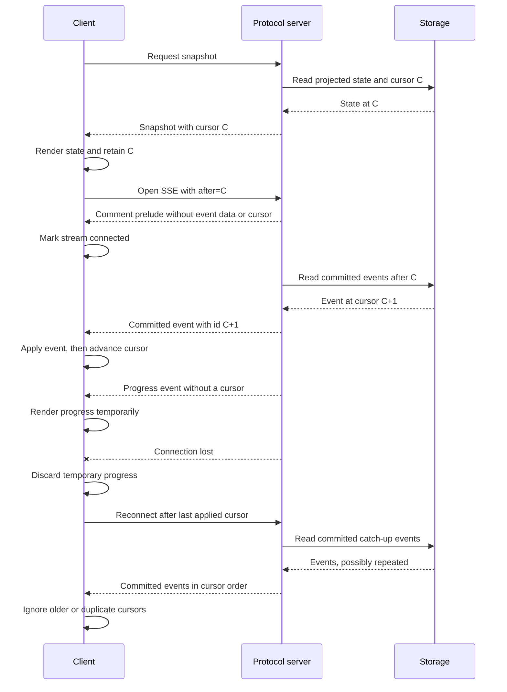

# Public HTTP, JSON, server-sent events, and `AgentClient` protocol

Agencity exposes one public client protocol through `ProtocolServer`. `HttpProtocolTransport` sends requests over HTTP and uses server-sent events (SSE) for live updates, while `InProcessProtocolTransport` constructs a standard `Request` and calls the same router. Both transports use the same route validation, JSON shapes, domain services, and typed failures.

Generated TypeScript cells use a separate private worker RPC. That boundary is not an external extension protocol; it is documented in [Generated TypeScript console SDK](./console-sdk.md).

## Server modes and authentication

### Managed product service

Ordinary product commands discover or start a per-workspace managed service. It:

- binds an ephemeral `127.0.0.1` port;
- writes an owner-only discovery manifest;
- requires `Authorization: Bearer <token>` on every route, including `/health` and SSE;
- owns startup recovery, local process fencing, resident run advancement, schedules, and graceful drain.

The token is read from the manifest and is not placed in argv, URLs, events, or output. Authenticated health includes workspace and service identity, application/protocol versions, readiness, and the configuration hash used during discovery.

The service shuts down after one hour of quiescence by default. The normalized `idleShutdownMs` is part of that configuration hash, so clients with a different default receive `CONFIG_MISMATCH` while the current owner remains live. A live REPL namespace and an idle console worker are not keep-alive reasons.

This is authenticated local process access, not multi-tenant authorization or a hostile-code sandbox.

### Embedded diagnostic server

`agencity debug protocol-serve --port 3131` starts an advanced embedded diagnostic server on `127.0.0.1`. It is unauthenticated and has no discovery manifest, service lease, resident-run queue, or idle lifecycle. Do not expose it to an untrusted network.

`ProtocolServer` also accepts an optional bearer token for a custom embedded host, but the host remains responsible for discovery, authorization, TLS, execution ownership, and lifecycle.

## Response and error envelopes

Successful non-streaming responses are route-specific JSON values. Failures use:

```json
{
  "error": {
    "code": "VALIDATION_ERROR",
    "message": "Scrubbed human-readable message",
    "details": null
  }
}
```

Domain errors map as follows:

| Code | HTTP status |
|---|---:|
| `VALIDATION_ERROR` | 400 |
| `NOT_FOUND` | 404 |
| `CONFLICT`, `INVALID_TRANSITION`, `EXECUTION_OWNERSHIP_CONFLICT` | 409 |
| `DEPENDENCY_FAILURE` | 424 |
| `CAPABILITY_UNAVAILABLE` | 501 |
| unexpected failure as `INTERNAL` | 500 |

Unknown routes return 404/`NOT_FOUND`. `AgentClient` raises `ProtocolClientError { code, status, details }` for the same failures over HTTP and in-process transports.

## Route conventions

Conversation, run, and branch mutations and reads are branch-scoped. The documented form is `?branch=<branchId>`. Snapshot, history, and stream also accept the retained path-segment compatibility form, but new integrations should use the query parameter. Agent-profile inspection is session-scoped because the active profile belongs to the session across all conversation branches.

Session, branch, event, effect, task, and handle IDs are opaque strings. SSE cursors are decimal strings and may exceed JavaScript's safe integer range; retain them as strings.

### Discovery, service, product catalog, and providers

| Method and path | Result |
|---|---|
| `GET /health` | Managed authenticated identity/version/config/readiness, or basic embedded health. |
| `GET /capabilities` | Protocol/runtime capabilities, raw provider descriptors, and the fixed agent-tool contract. With no query it reports all transports; with both `provider` and `model` it also returns selected-model admission. Supplying only one selector is invalid. |
| `GET /model-catalog` | Normalized Gateway language-model descriptors, catalog endpoint identity, origin, freshness, capacity, pricing, and reasoning capability. It refreshes an absent or stale cache and reports cached fallback or unavailability explicitly. |
| `POST /model-catalog/refresh` | Bounded public Gateway catalog refresh, with an explicit cached-fallback or unavailable result. |
| `GET /model-providers` | Secret-free raw supervisor provider descriptors. Product UIs must apply product policy; Echo is an internal test fixture, not a product-selectable provider. |
| `GET /service/status` | Managed-only lifecycle, recovery, exact `idleShutdownMs` (default `3600000`), idle deadline, attached clients, keep-alive reasons, and resident root workers. |
| `POST /service/shutdown` | Managed-only accepted graceful drain. It does not cancel sessions. |
| `GET /service/agents` | Managed-only named root sessions and resident worker states. |
| `GET /product/sessions` | Managed-only `ProductBranchSummary[]` catalog for every retained workspace branch, including exact IDs, names, model, status, task summary, counts, timestamps, and root classification. |
| `POST /product/select` | Managed-only `{ target?, branchId? }` selection; returns `{ sessionId, branchId }`. |
| `POST /product/rename` | Managed-only `{ sessionId, branchId?, name }`. |
| `GET /product/config?model=CREATOR%2FMODEL` | Managed-only workspace default model, normalized catalog/execution origins, the model-specific effort preference, opaque credential references, and secret-free provider descriptors. |
| `POST /product/config/model` | Managed-only `{ model: "provider:creator/model" \| null }`. |
| `POST /product/config/reasoning-effort` | Managed-only `{ model: "creator/model", effort: ReasoningEffort \| null }`; sets or clears the workspace/catalog/model preference. |
| `POST /product/config/provider-key` | Managed-only `{ provider, apiKey: string \| null }`; stores or removes a supported key and returns status without the value. |
| `POST /product/config/credential-reference` | Managed-only `{ provider, reference, label }`; stores an opaque reference, not credential bytes. |

The supported product providers are OpenAI, Anthropic, and Vercel AI Gateway. Echo can appear in low-level descriptors because it is installed for deterministic tests, but product onboarding, selection, help, and status must exclude it.

`GET /product/sessions` is a read-only catalog operation and does not change the remembered workspace route. Clients use `root === true` to select top-level work while retaining every branch of each root session. `failed` and `archived` rows remain in the response, but `POST /product/select` rejects them as non-resumable. An exact successful selection changes the remembered route used by later no-argument product resume.

Selected capability query values must be nonblank UTF-8 strings. Provider is limited to 256 bytes and model to 512 bytes. The response state is exactly `provider-strict`, `runtime-validated`, `unknown`, or `unavailable`. Credential usability is reported separately from formal-contract capability, and this route never calls a provider. The shipped transports prove the formal primitives, while exact public-catalog model support normally remains `unknown` because the catalog has no authoritative formal-tool fields.

### Sessions, branches, runs, cells, and recovery

| Method and path | Input and result |
|---|---|
| `POST /sessions` | `{ workspaceId?, model?, budget?, agentProfile?: { role, purpose, instructions }, sessionName?, branchName? }` → `{ sessionId, branchId }`; omitted `agentProfile` uses the sealed root profile and product model configuration includes `reasoningEffort`. |
| `GET /sessions/:session/agent-profile` | Bounded active profile summary. Add `?detail=full` to include instructions, exact rendered prompt, evidence IDs, and revision provenance. |
| `GET /sessions/:session/agent-profiles` | Newest-first bounded history with `{ activeProfileVersionId, items }`. Optional `detail=full`; `limit` defaults to 20 and must be 1–100. |
| `POST /sessions/:session/profile-proposals?branch=:branch` | Owner route for an agent-profile replacement: expected version, replacement, reason, predicted effect, evidence, optional objective post-activation evaluation, optional revised-proposal/client request IDs, and `wait` (default `true`) → `GovernedRefinementRecord`. |
| `POST /sessions/:session/profiles/rollback?branch=:branch` | Exact-content profile or harness rollback with target kind/ID, expected current version, earlier approved version, reason, and evidence → `RefinementRollbackResult`. |
| `POST /sessions/:session/model?branch=:branch` | `{ model: { provider, model, reasoningEffort? } }` → explicit idle-branch model or effort change. |
| `GET /sessions/:session/snapshot?branch=:branch` | `{ cursor, state }`. |
| `GET /sessions/:session/model-contract-diagnostics?branch=:branch` | Projection-derived fixed-cardinality formal submission and violation diagnostics for the branch. |
| `GET /sessions/:session/history?branch=:branch` | Ordered branch-lineage `AgentEvent[]`. |
| `GET /sessions/:session/stream?branch=:branch&after=:cursor` | Committed-event SSE plus cursorless progress. |
| `POST /sessions/:session/messages?branch=:branch` | `{ content }` → committed user message event. |
| `POST /sessions/:session/runs?branch=:branch` | `{ task, requestKey?, goalMode?, goalId? }` → run result or managed acceptance. |
| `GET /sessions/:session/runs/:run?branch=:branch` | Current retained `AgentRunResult`. |
| `POST /sessions/:session/runs/:run/resume?branch=:branch` | Advance the retained run. |
| `POST /sessions/:session/runs/:run/cancel?branch=:branch` | `{ reason? }` → cancellation-reconciled result. |
| `POST /sessions/:session/stop?branch=:branch` | Managed-only `{ reason? }` → cancel the active run, if any. |
| `POST /sessions/:session/turns?branch=:branch` | Advanced diagnostic compatibility run using the branch's latest retained user message and the canonical `AgentRunRequested` profile-pin boundary. |
| `POST /sessions/:session/cells?branch=:branch` | `{ code }` → `{ cellId, result, logs }`. |
| `POST /sessions/:session/branches?branch=:parent` | `{ cursor, name?, compactionStrategy? }` → `{ branchId }`. |
| `POST /sessions/:session/resume?branch=:branch` | Rebuild and reattach to a retained branch. |
| `GET /sessions/:session/context?branch=:branch` | Effective context inspection with source provenance. |
| `POST /sessions/:session/compact?branch=:branch` | Context compaction options → retained compaction view. |
| `GET /sessions/:session/recovery-summary?branch=:branch` | Pending/unknown effects, active/cancelling work, gate attention, and terminal notices. |
| `GET /sessions/:session/effects/unknown?branch=:branch` | Unknown effects, assessments, and safe actions. |
| `GET /sessions/:session/effects/:effect/reconciliation?branch=:branch` | One unknown effect and assessment history. |
| `POST /sessions/:session/effects/:effect/reconciliation?branch=:branch` | Append `{ reconciliationId?, assessment, summary, evidence?, recordedBy }`; durable effect status remains unknown. |

Managed `POST .../runs` admits the run, returns HTTP 202 with stable run/cursor identity, and advances it on the resident queue. The embedded server calls `runs.start`. Missing information becomes a blocked `finish`; a later user message starts an ordinary new run. There is no separate run-input route or retained input-request state.

`POST .../cells` evaluates code in the private console's persistent exact-session-and-branch REPL worker. Top-level bindings and object identity remain available across calls while that worker lives. Heap contents never appear in snapshots, event history, SSE, provider input, or protocol export. Autonomous provider input and `AgentRunModelAttemptStarted` retain only the cold/warm epoch identity used by the pre-execution guard; `CellFailed` may retain a typed expected/current mismatch. Runtime throws retain completed in-memory mutations in a surviving worker while staged state and artifact writes remain uncommitted; non-runtime failures recycle the worker. There is no public namespace-status or recovery route.

Profile summaries include version/session IDs, revision, role, purpose, prompt contract and digest, creator, optional specification source IDs, reason, creation time, and active status. Full detail additionally returns `instructions`, `exactAgentPrompt`, evidence IDs, supersession/restoration IDs, and proposal/review IDs. Normal reads omit prompt-bearing fields to keep lists bounded. Reads are observational. Proposal and rollback are explicit mutations and require a live route.

Model-contract diagnostics always return three submission counters—`bun_console`, `finish`, and sealed refinement review—nine violation counters, an unclassified-submission count, and at most 32 recent bounded outcomes plus an omitted count. They derive from canonical projections and retained structured recursive results. They add no mutable table and never expose rejected argument bodies.

`reasoningEffort` is `provider-default`, `none`, `minimal`, `low`, `medium`, `high`, or `xhigh`. Clients that send an effort configuration first require `reasoningEffortSelection` from `/capabilities`; an older server fails with `CAPABILITY_UNAVAILABLE` rather than ignoring the field. Existing clients remain compatible because omitted effort normalizes to `provider-default`.

Reconciliation is evidence-only. It never rewrites an unknown effect, reports a retry, or executes a successor operation.

### Agent invocations, mailboxes, documents, raw AI, goals, and wakes

| Method and path | Meaning |
|---|---|
| `POST /sessions/:session/agent-invocations?branch=:branch` | Admit one runnable detached agent invocation and return HTTP 202 with its durable task/run handle. |
| `POST /sessions/:session/agent-invocations/batch?branch=:branch` | Atomically admit `{ inputs }` as runnable detached invocations. |
| `GET /sessions/:session/agent-invocations/by-key?branch=:branch&idempotencyKey=:key` | Recover an invocation handle after disconnect before handle delivery. |
| `GET /sessions/:session/agent-invocations/:task/result?branch=:branch` | Read queued, running, or terminal text/object result without holding admission open. |
| `GET /sessions/:session/agent-invocations/:task/contract?branch=:branch` | Inspect the immutable text or declared-object invocation contract. |
| `POST /sessions/:session/agent-invocations/:task/cancel?branch=:branch` | `{ reason? }` → cancellation-reconciled task/run result. |
| `GET /sessions/:session/agents?branch=:branch` | Nuclear-family roster and task state. |
| `POST /sessions/:session/agents?branch=:branch` | Low-level family admission without the current public runnable-invocation composition. |
| `POST /sessions/:session/agents/batch?branch=:branch` | Low-level atomic family admission. |
| `POST /sessions/:session/agents/:target/cancel?branch=:branch` | Cancel a permitted family target. |
| `GET /sessions/:session/tasks?branch=:branch` | Durable branch task records. |
| `POST /sessions/:session/tasks/:task/cancel?branch=:branch` | Cascaded task cancellation. |
| `GET /sessions/:session/mailbox?branch=:branch&direction=all&limit=20&before=:cursor&pending=1` | Bounded mailbox page. |
| `POST /sessions/:session/mailbox?branch=:branch` | `SendMessageInput` with optional `mode: "steer" \| "queue"` → durable delivery receipt. A new non-legacy queued receipt includes its deterministic immutable `runId`; exact intent-key reuse returns the same message and run IDs. |
| `GET /sessions/:session/mailbox/:message/result?branch=:branch` | Sender-authorized observational result lookup. Before admission it is queued with zero steps; delivery failure is failed without a fabricated run; after admission it returns the retained `AgentRun` status/result. |
| `POST /sessions/:session/mailbox/:message/ack?branch=:branch` | Acknowledge a message. |
| `POST /sessions/:session/documents?branch=:branch` | Import a chunked document. |
| `POST /sessions/:session/input-sets?branch=:branch` | Create an exact ordered input set. |
| `POST /sessions/:session/ai/generations?branch=:branch` | Admit one raw text or declared-object generation and return its durable handle immediately. |
| `GET /sessions/:session/ai/generations/by-key?branch=:branch&idempotencyKey=:key` | Recover a generation handle by caller idempotency key. |
| `GET /sessions/:session/ai/generations/:generation?branch=:branch` | Read a generation handle within its exact calling route. |
| `GET /sessions/:session/ai/generations/:generation/result?branch=:branch` | Read the current typed result within its exact calling route without holding an HTTP request open. |
| `POST /sessions/:session/ai/generations/:generation/cancel?branch=:branch` | `{ reason? }` → durably cancel a generation within its exact calling route. |
| `GET /sessions/:session/goals?branch=:branch` | List goals. |
| `POST /sessions/:session/goals?branch=:branch` | Create a goal and gates. |
| `GET /sessions/:session/goals/current?branch=:branch` | Current user-authoritative goal or `null`. |
| `GET /sessions/:session/goals/:goal?branch=:branch` | One scoped goal. |
| `GET /sessions/:session/goals/:goal/evaluations?branch=:branch&gate=:gate` | Retained gate evaluations. |
| `POST /sessions/:session/goals/:goal/completion?branch=:branch` | Request gate-checked completion. |
| `POST /sessions/:session/goals/:goal/continue?branch=:branch` | Continue under an optional turn bound. |
| `POST /sessions/:session/goals/:goal/pause\|resume\|clear?branch=:branch` | Goal lifecycle change. |
| `GET /sessions/:session/heartbeats?branch=:branch` | List heartbeats. |
| `POST /sessions/:session/heartbeats?branch=:branch` | Create a user-owned heartbeat. |
| `POST /heartbeats/:id/tick\|pause\|resume\|clear` | Heartbeat lifecycle operation. `cancel` is also accepted as a compatibility alias for `clear`. |
| `GET /sessions/:session/schedules?branch=:branch` | List schedules. |
| `POST /sessions/:session/schedules?branch=:branch` | Create a user-owned one-time or interval schedule. |
| `GET /sessions/:session/schedules/wakes?branch=:branch&status=...` | Durable wake records. |
| `POST /schedules/:id/tick\|pause\|resume\|clear` | Schedule lifecycle operation. |

Agent-invocation admission is asynchronous and always runnable. The model-facing `spawn` input has no `run` boolean. Client `runAgent` composes admission with bounded result polling, while console `sdk.agents.run` and `runMany` use the same durable handle/result lifecycle over worker RPC. Text output is the default; object output uses a restricted declared schema. Structured validity proves shape only, not factual correctness, task completion, safety, or authority. Unsatisfiable awaited console capacity fails before child admission. The protocol has no public recursive-model or `/models` admission route; retained recursive-model events and handles remain available only through advanced historical inspection and supervisor-private sealed workflows.

Raw generation similarly returns a durable handle immediately. `AgentClient.generateText` and `generateObject` compose admission and result waiting. A raw call receives only its fixed host instruction, explicit prompt/messages, and explicit bounded context. It cannot inspect files, call tools, use skills, read ambient branch context, or continue autonomously.

The family roster is an additive deterministic read projection. Each item contains the exact `sessionId` and `branchId`, display name, relationship, depth, session status, related task identity and status, task summary, model configuration, cancellation-request flag, activity, and bounded activity reason. Activities are `working`, `idle`, `attention`, `ended`, or `unavailable`, with reasons `blocked`, `failed`, `budget_exceeded`, `unknown`, `cancellation_pending`, `cancelled`, `archived`, `missing_state`, or `null`.

`working` requires a running task, queued/running agent run, or running session. An admitted child with no active run is `idle`. A parent row retains the task edge that relates it to the current child, but its activity is derived from the parent route rather than from that child task.

Only task edges admitted from the requested branch appear as direct children. A missing child or sibling branch, or an expected child or sibling task projection, remains an `unavailable` item rather than being omitted or redirected to another branch. Reading the roster and opening one of its routes appends no event and does not change task or execution ownership. Clients continue to watch the opened conversation through its own snapshot-plus-cursor stream; cursorless progress does not alter family activity.

Family targets are URL-decoded and restricted to the caller's parent, direct children, or siblings. Sender identity comes from the path session/branch. Mailbox receipts retain queued, context-delivered, acknowledged, or failed state with relationship, task, artifact, mode, optional context-run, legacy-follow-up, and reply provenance. New `queue` messages derive `runId` from the immutable mailbox message ID without adding canonical state. `steer` and retained legacy `followUp` rows expose no independent run ID or result. Result lookup never routes, admits, or reorders work.

### Memory, refinement, skills, and specifications

| Method and path | Meaning |
|---|---|
| `POST /sessions/:session/memory?branch=:branch` | Create scoped memory. |
| `GET /sessions/:session/memory?branch=:branch&query=...` | Search with optional `scopes`, `statuses`, `tags`, `linkedEntryIds`, `since`, and `limit`; returns full provenance. |
| `GET /sessions/:session/memory/list?branch=:branch` | List visible memory. |
| `POST /sessions/:session/refinement-reviews?branch=:branch` | Admit an attributable trajectory review. |
| `GET /sessions/:session/refinement-reviews?branch=:branch&status=...` | List branch review records. |
| `GET /sessions/:session/refinement-reviews/:review?branch=:branch` | Read one branch-owned review. |
| `GET /refinement-reviews?status=...` | Workspace-wide review diagnostics. |
| `GET /sessions/:session/learning/status?branch=:branch` | Effective device policy, review-linked pending count, and latest session learning activity. Malformed retained policy is reported as `automaticLearning: "unavailable"` with `policyError: "validation_failed"` rather than hiding retained activity. |
| `GET /sessions/:session/learning/history?branch=:branch&limit=...` | Newest-first session audit log joining bounded reflection summaries, governed decision/application, grouped rollback, and typed nonfatal scan-observation provenance. `limit` is 1–100, the serialized view has a 256 KiB ceiling, and `{ byteLimit, truncated }` reports the bound. The route branch is retained for uniform addressing; local learned content and this log are session-scoped. |
| `GET /sessions/:session/learning/activities/:activity?branch=:branch` | Inspect one session-owned reflection or scan observation by activity ID. |
| `POST /sessions/:session/user-corrections?branch=:branch` | Append a typed correction citing earlier branch event IDs. |
| `GET /refinement-policy` | Read the device-wide automatic-learning enablement flag and the complete effective local trigger policy, including repeated-success defaults. |
| `PUT /refinement-policy` | `{ enabled: boolean }`. `false` persists a device-wide pause; `true` resumes automatic learning. |
| `GET /refinement-capabilities` | Reports sealed automatic governance, supported target kinds, wait/detach/rollback, and `reviewerSelectableByCaller: false`. |
| `GET /governed-refinements?status=...&limit=...` | Bounded workspace governance records. |
| `GET /governed-refinements/:proposal` | One exact governed proposal, validation, frozen input, reviewer link/decision, terminal reason, versions, and notice state. |
| `POST /sessions/:session/governed-refinements?branch=:branch` | Owner proposal for an agent-profile or harness target. `wait` defaults to `true`; `false` returns after durable admission and later delivers a terminal notice. |
| `GET /sessions/:session/governed-refinements?branch=:branch&status=...&limit=...` | Route-scoped governed proposal records. |
| `POST /sessions/:session/governed-refinements/:proposal/rollback?branch=:branch` | Owner reversal of one applied automatic local proposal. The server derives and atomically applies exact inverse actions for create, replace, retire, and multi-edit proposals; callers provide only reason and evidence IDs. |
| `POST /sessions/:session/refinements?branch=:branch` | Submit a governed raw proposal. |
| `POST .../refinements/:proposal/validate` | Validate shape, evidence, authority, conflicts, and compare-and-swap targets. |
| `POST .../refinements/:proposal/activate` | Create/test candidates and set bounded exposure. |
| `POST .../refinements/:proposal/allocate` | Allocate a candidate. |
| `POST .../refinements/:proposal/observations` | Record attributable evaluation evidence. |
| `POST .../refinements/:proposal/approve` | Record user/global promotion approval. |
| `POST .../refinements/:proposal/decide` | Promote, revise, or reject. |
| `POST .../refinements/:proposal/approve-rollback` | Separately authorize user/global rollback. |
| `POST .../refinements/:proposal/rollback` | Roll back exact promoted versions. |
| `GET /harness` | Current harness entries. |
| `GET /harness/:entry/history` | Immutable version history. |
| `GET /harness/refinements?status=...` | Proposal lifecycle records. |
| `GET /sessions/:session/skills?branch=:branch&includeUnavailable=true` | List managed skills. |
| `GET /sessions/:session/skills/:reference?branch=:branch` | Resolve a skill by name or ID. |
| `POST /sessions/:session/skills/preview-import?branch=:branch` | Preview a local skill directory import. |
| `POST /sessions/:session/skills/import?branch=:branch` | Install a local skill version. |
| `POST /sessions/:session/skills/propose?branch=:branch` | Propose a local/workspace skill from instructions. |
| `POST /sessions/:session/skills/:reference/enable\|disable\|remove?branch=:branch` | Manage skill availability. |
| `POST /sessions/:session/skills/:reference/test?branch=:branch` | Run durable compile/runtime tests. |
| `POST /sessions/:session/skills/:reference/invoke?branch=:branch` | Invoke an exact or resolved skill version. |
| `POST /sessions/:session/specs/:entry/spawn?branch=:branch` | Admit a version-pinned reusable subagent specification. |

Skill installation and enable/disable/remove are client/user management operations. Generated cells receive only list, get, propose, test, and invoke surfaces.

The `.../refinements/:proposal/{validate,activate,allocate,observations,approve,decide,approve-rollback,rollback}` routes retain ADR-0002 candidate/evaluation behavior for advanced and legacy-compatible integrations. They are not the ordinary activation path. Ordinary profile and harness revisions use governed proposals, one separate sealed reviewer, application-time revalidation, automatic application, terminal delivery, and exact-content rollback.

Governed statuses are `proposed`, `deterministically_rejected`, `validated`, `reviewing`, `reviewed_rejected`, `review_failed`, `review_unknown`, `reviewed_approved`, `apply_conflict`, `apply_failed`, and `applied`. The reviewer uses the origin route's current model. New frozen inputs use version 3 and include deterministic evidence excerpts under one 32 KiB aggregate budget, with canonical/redacted payload and excerpt digests, exact byte counts, truncation, and credential/repository-instruction redaction provenance. Retained version-1 and version-2 inputs remain readable. Automatic trajectory proposals require and retain objective post-activation evaluation intent; direct proposals may omit it, and it does not gate ordinary activation. Frozen input also includes immutable product constitution and review policy; unsupported workspace-charter and user-constraint components are explicitly `null`. No request field selects a reviewer. Approval states policy consistency, not outcome proof.

### Synchronization, export, and deletion

| Method and path | Meaning |
|---|---|
| `GET /sync/status` | Capabilities, replica lifecycle, conflicts, and quarantine count. |
| `POST /sync` | Manual complete synchronization cycle. |
| `POST /sync/reconnect` | Reconnect and run a cycle. |
| `POST /sync/push` | Stage and perform directional push when supported. |
| `POST /sync/pull` | Directional pull and local ingestion when supported. |
| `POST /sync/checkpoint` | Transport checkpoint when supported. |
| `GET /sync/stats` | Transport change-data-capture (CDC), write-ahead-log (WAL), revision, and network statistics when supported. |
| `GET /sync/conflicts?status=unresolved\|resolved` | List conflict records. |
| `POST /sync/conflicts/:id/resolve` | Apply an explicit `ResolveConflictInput`. |
| `GET /sync/workspaces?refresh=1` | Replicated workspace announcements; refresh performs a pull first. |
| `POST /sync/manifests` | Create an ownership-aware export/deletion manifest. |
| `POST /sync/export` | Export events, redaction-safe profile data, envelopes, verified artifacts, and a manifest. |
| `POST /sync/delete` | Perform confirmed owned-scope physical deletion and return a receipt. |

`POST /sessions/:session/refinement-reviews` accepts `{ instructions?, requestedScope?, allowedKinds?, wait? }`. `allowedKinds` is a non-empty subset of `memory`, `prompt_note`, `skill`, and `subagent_spec`. The protocol API defaults `wait` to `true` for compatibility; product CLI and TUI commands explicitly send `false` unless the user selects `--wait`.

`POST /sync/delete` requires `{ scopeKind, scopeId, requestedBy, confirmation, receiptDirectory? }`, where confirmation exactly equals `DELETE <scopeKind> <scopeId>`. Workspace/profile deletion requires an external receipt directory. Managed remote evidence can block deletion when authenticated administration is absent or the selected granularity is unsupported.

## `AgentClient`

Construct the client from a base URL or a transport:

```ts
import {
  AgentClient,
  InProcessProtocolTransport,
} from "@prime-agent/runtime/protocol";

const httpClient = new AgentClient(
  "http://127.0.0.1:3131",
  managedBearerToken,
);

const embeddedClient = new AgentClient(
  new InProcessProtocolTransport(protocolServer),
);
```

The client exposes typed methods for all route groups:

- discovery and service: `health`, `capabilities`, `serviceStatus`, `shutdownService`, `serviceAgents`;
- product catalog/configuration: `productSessions`, `productSelect`, `productRename`, `productConfig`, `productSetModel`, `productSetReasoningEffort`, `productSetProviderKey`, `productCredentialReference`, `modelProviders`, `modelCatalog`;
- session lifecycle, learning, and profile governance: `createSession`, `agentProfile`, `agentProfiles`, `proposeProfileUpdate`, `governedRefinement`, `proposeGovernedRefinement`, `governedRefinements`, `rollbackRefinement`, `rollbackGovernedRefinement`, `learningStatus`, `learningHistory`, `learningActivity`, `pauseAutomaticLearning`, `resumeAutomaticLearning`, `refinementCapabilities`, `snapshot`, `history`, `message`, `selectModel`, `fork`, `resume`, `stopSession`;
- autonomous runs and diagnostics: `startRun`, `run`, `resumeRun`, `cancelRun`, `turn`, `cell`, `agentToolCapability`, and `modelContractDiagnostics`;
- streaming: `stream`, `watchBranch`, `abortPendingRequests`;
- context/recovery: `inspectContext`, `compact`, `recoverySummary`, `unknownEffects`, `inspectUnknownEffect`, `reconcileUnknownEffect`;
- agents and raw generation: `spawn`, `spawnMany`, `agents`, `tasks`, `cancelTask`, `sendMailbox`, `mailbox`, `mailboxResult`, acknowledgement, agent cancellation, documents, input sets, and generation admission/lookup/result/wait/cancel methods;
- goals and wakes: goal, heartbeat, schedule, and wake methods;
- memory and refinement: memory, trajectory review, automatic policy, governed proposal/wait/detach/inspection/rollback, and advanced legacy-compatible candidate/evaluation methods;
- skill management: `listSkills`, `getSkill`, `previewSkillImport`, `installSkill`, `proposeSkill`, `enableSkill`, `disableSkill`, `removeSkill`, `testSkill`, `invokeSkill`, and `spawnSpec`;
- synchronization and data control: status/cycle/conflict/workspace methods plus `dataManifest`, `exportData`, and `deleteOwnedData`.

`AgentClient.fork` is the supported branch helper:

```ts
const { branchId } = await client.fork(
  sessionId,
  parentBranchId,
  cursor,
  "experiment",
  "deterministic-extractive-v1",
);
```

All returned handles are durable JSON values unless a method documents a transport-only callback or `AbortSignal`.

### Minimal run example

```ts
import { AgentClient } from "@prime-agent/runtime/protocol";

const client = new AgentClient(serviceUrl, bearerToken);
const session = await client.createSession("example", {
  model: {
    provider: "openai",
    model: "openai/gpt-5.6-sol",
    reasoningEffort: "high",
  },
  agentProfile: {
    role: "Repository reviewer",
    purpose: "Inspect this repository for the requested task.",
    instructions: "- Cite attributable evidence.\n- Preserve unresolved risks.",
  },
});

const activeProfile = await client.agentProfile(session.sessionId);
const fullProfile = await client.agentProfile(session.sessionId, true);
const profileHistory = await client.agentProfiles(session.sessionId, {
  includePrompt: false,
  limit: 20,
});

const admitted = await client.startRun(session.sessionId, session.branchId, {
  task: "Inspect the workspace",
  requestKey: "protocol-example-run",
});

const run = "accepted" in admitted && admitted.accepted
  ? await client.run(session.sessionId, session.branchId, admitted.runId)
  : admitted;

if (run.status === "blocked") {
  await client.startRun(session.sessionId, session.branchId, {
    task: "Here is the missing information: continue.",
    requestKey: "protocol-example-continuation",
  });
}
```

The managed route returns an acceptance shape from the server even though the current `startRun` TypeScript return annotation is `AgentRunResult`. Callers that connect to managed service mode should narrow the runtime response as shown or use product-level integration code that already handles admission. This annotation mismatch is a current typing limitation.

## Snapshot then SSE



A correct consumer:

1. calls `snapshot` and renders the returned state;
2. stores the cursor as an opaque string;
3. connects to `stream` with `after=<cursor>`;
4. applies each committed `AgentEvent` in order and advances only after successful application;
5. deduplicates repeated or older committed cursors;
6. treats `event: progress` as temporary display state;
7. clears progress and reconnects from the last applied committed cursor after disconnection.

A committed frame uses:

```text
id: <cursor>
data: <AgentEvent JSON>
```

A progress frame uses:

```text
event: progress
data: <EffectProgressNotification JSON>
```

Progress has no cursor, is not replayed, and may be bounded or dropped. Structured model progress exposes only a bounded phase, a sealed tool name, or a byte count. Provider/model/call identities and provisional arguments remain private and non-executable. Text operations may still stream bounded provisional text. Only a validated terminal text result or accepted `finish` message can enter assistant conversation.

The endpoint begins with the SSE comment `: connected` so a quiet branch opens immediately. The comment has no event name, data, cursor, or durable meaning, and clients ignore it after recognizing that the HTTP stream is connected. The loopback HTTP server disables Bun's request idle timeout for this route only, so a quiet attached client remains connected without periodic heartbeat frames.

The endpoint does not emit the initial snapshot, periodic heartbeat frames, or an explicit end marker. Publication happens after commit, and catch-up reads storage rather than trusting an in-memory notification, so delivery should be treated as at least once.

`watchBranch` implements this algorithm. It serializes event callbacks, advances its cursor only after a callback succeeds, reconnects from that cursor, and reports when temporary progress must be discarded. `runAgent`, `generateText`, and `generateObject` use this shared watch path for terminal waiting and always perform one final retained result read on terminal detection or timeout; they do not maintain independent short-interval polling loops.

## Exported protocol types

`ProtocolCapabilities`, `ProtocolClientError`, stream/watch handler types, `SnapshotEnvelope`, and `EventEnvelope` describe active public behavior.

The exported `ProtocolRequest` and `ProtocolResponse` unions in `protocol/types.ts` are partial legacy types. The router and `AgentClient` do not dispatch through them, and they omit many current HTTP operations. Do not use `ProtocolRequest` as an exhaustive route registry or build a new transport around its `type` discriminator. Use `AgentClient`, `ProtocolTransport.request`, or the documented HTTP routes.

## Security and compatibility limits

- Managed service protocol revision 2 is a pre-release exact-match contract and is trusted-local. Incompatible client/service revisions fail discovery with `PROTOCOL_MISMATCH`; no old recursive-model or `/models` route is emulated.
- Additive capabilities are negotiated through `/capabilities`; effort-aware clients must not send an effort field when `reasoningEffortSelection` is absent.
- Managed authentication is owner-local bearer access, not multi-tenant authorization.
- The embedded diagnostic server is unauthenticated.
- No WebSocket transport, TLS termination, non-loopback deployment, or in-place protocol upgrade negotiation is provided.
- Domain services remain authoritative; transport routing does not weaken scope, budget, ownership, gate, mailbox, or idempotency rules.

See [TypeScript integration API](./api.md), [Trusted-local security boundary](./security.md), and [Crash recovery and unknown effects](./recovery.md).
