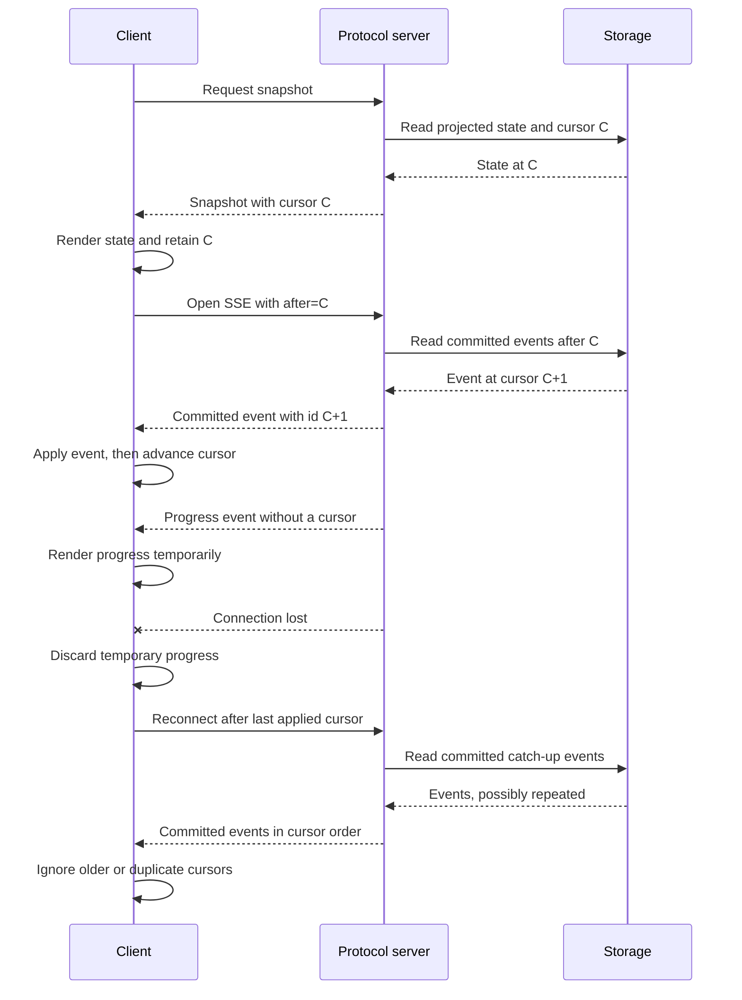

# Public HTTP, JSON, server-sent events, and `AgentClient` protocol

Agencity exposes one public client protocol through `ProtocolServer`. `HttpProtocolTransport` sends requests over HTTP and uses server-sent events (SSE) for live updates, while `InProcessProtocolTransport` constructs a standard `Request` and calls the same router. Both transports use the same route validation, JSON shapes, domain services, and typed failures.

Generated TypeScript cells use a separate private worker RPC. That boundary is not an external extension protocol; it is documented in [Generated TypeScript console SDK](./console-sdk.md).

## Server modes and authentication

### Managed product service

Ordinary product commands discover or start a per-workspace managed service. It:

- binds an ephemeral `127.0.0.1` port;
- writes an owner-only discovery manifest;
- requires `Authorization: Bearer <token>` on every route, including `/health` and SSE;
- owns startup recovery, local process fencing, resident run advancement, schedules, and graceful drain.

The token is read from the manifest and is not placed in argv, URLs, events, or output. Authenticated health includes workspace and service identity, application/protocol versions, readiness, and the configuration hash used during discovery.

This is authenticated local process access, not multi-tenant authorization or a hostile-code sandbox.

### Embedded diagnostic server

`agencity debug protocol-serve --port 3131` starts an advanced embedded diagnostic server on `127.0.0.1`. It is unauthenticated and has no discovery manifest, service lease, resident-run queue, or idle lifecycle. Do not expose it to an untrusted network.

`ProtocolServer` also accepts an optional bearer token for a custom embedded host, but the host remains responsible for discovery, authorization, TLS, execution ownership, and lifecycle.

## Response and error envelopes

Successful non-streaming responses are route-specific JSON values. Failures use:

```json
{
  "error": {
    "code": "VALIDATION_ERROR",
    "message": "Scrubbed human-readable message",
    "details": null
  }
}
```

Domain errors map as follows:

| Code | HTTP status |
|---|---:|
| `VALIDATION_ERROR` | 400 |
| `NOT_FOUND` | 404 |
| `CONFLICT`, `INVALID_TRANSITION`, `EXECUTION_OWNERSHIP_CONFLICT` | 409 |
| `DEPENDENCY_FAILURE` | 424 |
| `CAPABILITY_UNAVAILABLE` | 501 |
| unexpected failure as `INTERNAL` | 500 |

Unknown routes return 404/`NOT_FOUND`. `AgentClient` raises `ProtocolClientError { code, status, details }` for the same failures over HTTP and in-process transports.

## Route conventions

Session mutations and reads are branch-scoped. The documented form is `?branch=<branchId>`. Snapshot, history, and stream also accept the retained path-segment compatibility form, but new integrations should use the query parameter.

Session, branch, event, effect, task, and handle IDs are opaque strings. SSE cursors are decimal strings and may exceed JavaScript's safe integer range; retain them as strings.

### Discovery, service, product catalog, and providers

| Method and path | Result |
|---|---|
| `GET /health` | Managed authenticated identity/version/config/readiness, or basic embedded health. |
| `GET /capabilities` | Protocol version, trusted-local mode, snapshot/resume, progress, historical projection, managed-service/catalog availability, sync capabilities, and raw provider descriptors. |
| `GET /model-providers` | Secret-free raw supervisor provider descriptors. Product UIs must apply product policy; Echo is an internal test fixture, not a product-selectable provider. |
| `GET /service/status` | Managed-only lifecycle, recovery, idle deadline, attached clients, keep-alive reasons, and resident root workers. |
| `POST /service/shutdown` | Managed-only accepted graceful drain. It does not cancel sessions. |
| `GET /service/agents` | Managed-only named root sessions and resident worker states. |
| `GET /product/sessions` | Managed-only human-readable product session/branch catalog. |
| `POST /product/select` | Managed-only `{ target?, branchId? }` selection; returns `{ sessionId, branchId }`. |
| `POST /product/rename` | Managed-only `{ sessionId, branchId?, name }`. |
| `GET /product/config` | Managed-only workspace default model, opaque credential references, and secret-free provider descriptors. |
| `POST /product/config/model` | Managed-only `{ model: "provider:model" \| null }`. |
| `POST /product/config/provider-key` | Managed-only `{ provider, apiKey: string \| null }`; stores or removes a supported key and returns status without the value. |
| `POST /product/config/credential-reference` | Managed-only `{ provider, reference, label }`; stores an opaque reference, not credential bytes. |

The supported product providers are OpenAI, Anthropic, and Vercel AI Gateway. Echo can appear in low-level descriptors because it is installed for deterministic tests, but product onboarding, selection, help, and status must exclude it.

### Sessions, branches, runs, cells, and recovery

| Method and path | Input and result |
|---|---|
| `POST /sessions` | `{ workspaceId?, model?, budget?, sessionName?, branchName? }` → `{ sessionId, branchId }`. |
| `POST /sessions/:session/model?branch=:branch` | `{ model: { provider, model } }` → explicit idle-branch model change. |
| `GET /sessions/:session/snapshot?branch=:branch` | `{ cursor, state }`. |
| `GET /sessions/:session/history?branch=:branch` | Ordered branch-lineage `AgentEvent[]`. |
| `GET /sessions/:session/stream?branch=:branch&after=:cursor` | Committed-event SSE plus cursorless progress. |
| `POST /sessions/:session/messages?branch=:branch` | `{ content }` → committed user message event. |
| `POST /sessions/:session/runs?branch=:branch` | `{ task, requestKey?, goalMode?, goalId? }` → run result or managed acceptance. |
| `GET /sessions/:session/runs/:run?branch=:branch` | Current retained `AgentRunResult`. |
| `POST /sessions/:session/runs/:run/resume?branch=:branch` | Advance the retained run. |
| `POST /sessions/:session/runs/:run/input/:request?branch=:branch` | `{ response, approved? }`; permission requires boolean `approved`. |
| `POST /sessions/:session/runs/:run/cancel?branch=:branch` | `{ reason? }` → cancellation-reconciled result. |
| `POST /sessions/:session/stop?branch=:branch` | Managed-only `{ reason? }` → cancel the active run, if any. |
| `POST /sessions/:session/turns?branch=:branch` | Advanced diagnostic one-turn model result. |
| `POST /sessions/:session/cells?branch=:branch` | `{ code }` → `{ cellId, result, logs }`. |
| `POST /sessions/:session/branches?branch=:parent` | `{ cursor, name?, compactionStrategy? }` → `{ branchId }`. |
| `POST /sessions/:session/resume?branch=:branch` | Rebuild and reattach to a retained branch. |
| `GET /sessions/:session/context?branch=:branch` | Effective context inspection with source provenance. |
| `POST /sessions/:session/compact?branch=:branch` | Context compaction options → retained compaction view. |
| `GET /sessions/:session/recovery-summary?branch=:branch` | Pending/unknown effects, active/cancelling work, gate attention, and terminal notices. |
| `GET /sessions/:session/effects/unknown?branch=:branch` | Unknown effects, assessments, and safe actions. |
| `GET /sessions/:session/effects/:effect/reconciliation?branch=:branch` | One unknown effect and assessment history. |
| `POST /sessions/:session/effects/:effect/reconciliation?branch=:branch` | Append `{ reconciliationId?, assessment, summary, evidence?, recordedBy }`; durable effect status remains unknown. |

Managed `POST .../runs` admits the run, returns HTTP 202 with stable run/cursor identity, and advances it on the resident queue. The embedded server calls `runs.start` and holds the request through the next terminal or user-waiting boundary.

Reconciliation is evidence-only. It never rewrites an unknown effect, reports a retry, or executes a successor operation.

### Agents, mailboxes, documents, models, goals, and wakes

| Method and path | Meaning |
|---|---|
| `GET /sessions/:session/agents?branch=:branch` | Nuclear-family roster and task state. |
| `POST /sessions/:session/agents?branch=:branch` | Admit one `SpawnAgentInput`. |
| `POST /sessions/:session/agents/batch?branch=:branch` | Atomically admit `{ inputs: SpawnAgentInput[] }`. |
| `POST /sessions/:session/agents/:target/follow-up?branch=:branch` | Retained same-session follow-up. |
| `POST /sessions/:session/agents/:target/cancel?branch=:branch` | Cancel a permitted family target. |
| `GET /sessions/:session/tasks?branch=:branch` | Durable branch task records. |
| `POST /sessions/:session/tasks/:task/cancel?branch=:branch` | Cascaded task cancellation. |
| `GET /sessions/:session/mailbox?branch=:branch&direction=all&limit=20&before=:cursor&pending=1` | Bounded mailbox page. |
| `POST /sessions/:session/mailbox?branch=:branch` | `SendMessageInput` → durable delivery receipt. |
| `POST /sessions/:session/mailbox/:message/ack?branch=:branch` | Acknowledge a message. |
| `POST /sessions/:session/documents?branch=:branch` | Import a chunked document. |
| `POST /sessions/:session/input-sets?branch=:branch` | Create an exact ordered input set. |
| `POST /sessions/:session/models?branch=:branch` | Start a retained recursive model call. |
| `GET /models/:handle` | Read a recursive model handle. |
| `POST /models/:handle/cancel` | `{ reason? }` → cancel a recursive model call. |
| `GET /sessions/:session/goals?branch=:branch` | List goals. |
| `POST /sessions/:session/goals?branch=:branch` | Create a goal and gates. |
| `GET /sessions/:session/goals/current?branch=:branch` | Current user-authoritative goal or `null`. |
| `GET /sessions/:session/goals/:goal?branch=:branch` | One scoped goal. |
| `GET /sessions/:session/goals/:goal/evaluations?branch=:branch&gate=:gate` | Retained gate evaluations. |
| `POST /sessions/:session/goals/:goal/completion?branch=:branch` | Request gate-checked completion. |
| `POST /sessions/:session/goals/:goal/continue?branch=:branch` | Continue under an optional turn bound. |
| `POST /sessions/:session/goals/:goal/pause\|resume\|clear?branch=:branch` | Goal lifecycle change. |
| `GET /sessions/:session/heartbeats?branch=:branch` | List heartbeats. |
| `POST /sessions/:session/heartbeats?branch=:branch` | Create a user-owned heartbeat. |
| `POST /heartbeats/:id/tick\|pause\|resume\|clear` | Heartbeat lifecycle operation. `cancel` is also accepted as a compatibility alias for `clear`. |
| `GET /sessions/:session/schedules?branch=:branch` | List schedules. |
| `POST /sessions/:session/schedules?branch=:branch` | Create a user-owned one-time or interval schedule. |
| `GET /sessions/:session/schedules/wakes?branch=:branch&status=...` | Durable wake records. |
| `POST /schedules/:id/tick\|pause\|resume\|clear` | Schedule lifecycle operation. |

The family roster is an additive deterministic read projection. Each item contains the exact `sessionId` and `branchId`, display name, relationship, depth, session status, related task identity and status, task summary, model configuration, cancellation-request flag, activity, and bounded activity reason. Activity is one of `working`, `waiting`, `idle`, `attention`, `ended`, or `unavailable`. Reasons are `waiting_for_user`, `permission_required`, `blocked`, `failed`, `budget_exceeded`, `unknown`, `cancellation_pending`, `cancelled`, `archived`, `missing_state`, or `null`.

Only task edges admitted from the requested branch appear as direct children. A missing child, branch, or expected task projection remains an `unavailable` item rather than being omitted or redirected to another branch. Reading the roster and opening one of its routes appends no event and does not change task or execution ownership. Clients continue to watch the opened conversation through its own snapshot-plus-cursor stream; cursorless progress does not alter family activity.

Family targets are URL-decoded and restricted to the caller's parent, direct children, or siblings. Sender identity comes from the path session/branch. Mailbox receipts retain queued, context-delivered, acknowledged, or failed state with relationship, task, artifact, and reply provenance.

### Memory, refinement, skills, and specifications

| Method and path | Meaning |
|---|---|
| `POST /sessions/:session/memory?branch=:branch` | Create scoped memory. |
| `GET /sessions/:session/memory?branch=:branch&query=...` | Search with optional `scopes`, `statuses`, `tags`, `linkedEntryIds`, `since`, and `limit`; returns full provenance. |
| `GET /sessions/:session/memory/list?branch=:branch` | List visible memory. |
| `POST /sessions/:session/refinement-reviews?branch=:branch` | Admit an attributable trajectory review. |
| `GET /sessions/:session/refinement-reviews?branch=:branch&status=...` | List branch review records. |
| `GET /sessions/:session/refinement-reviews/:review?branch=:branch` | Read one branch-owned review. |
| `GET /refinement-reviews?status=...` | Workspace-wide review diagnostics. |
| `POST /sessions/:session/user-corrections?branch=:branch` | Append a typed correction citing earlier branch event IDs. |
| `GET /refinement-policy` | Read the profile-owned automatic-trigger policy. |
| `PUT /refinement-policy` | `{ enabled: boolean }`. |
| `POST /sessions/:session/refinements?branch=:branch` | Submit a governed raw proposal. |
| `POST .../refinements/:proposal/validate` | Validate shape, evidence, authority, conflicts, and compare-and-swap targets. |
| `POST .../refinements/:proposal/activate` | Create/test candidates and set bounded exposure. |
| `POST .../refinements/:proposal/allocate` | Allocate a candidate. |
| `POST .../refinements/:proposal/observations` | Record attributable evaluation evidence. |
| `POST .../refinements/:proposal/approve` | Record user/global promotion approval. |
| `POST .../refinements/:proposal/decide` | Promote, revise, or reject. |
| `POST .../refinements/:proposal/approve-rollback` | Separately authorize user/global rollback. |
| `POST .../refinements/:proposal/rollback` | Roll back exact promoted versions. |
| `GET /harness` | Current harness entries. |
| `GET /harness/:entry/history` | Immutable version history. |
| `GET /harness/refinements?status=...` | Proposal lifecycle records. |
| `GET /sessions/:session/skills?branch=:branch&includeUnavailable=true` | List managed skills. |
| `GET /sessions/:session/skills/:reference?branch=:branch` | Resolve a skill by name or ID. |
| `POST /sessions/:session/skills/preview-import?branch=:branch` | Preview a local skill directory import. |
| `POST /sessions/:session/skills/import?branch=:branch` | Install a local skill version. |
| `POST /sessions/:session/skills/propose?branch=:branch` | Propose a local/workspace skill from instructions. |
| `POST /sessions/:session/skills/:reference/enable\|disable\|remove?branch=:branch` | Manage skill availability. |
| `POST /sessions/:session/skills/:reference/test?branch=:branch` | Run durable compile/runtime tests. |
| `POST /sessions/:session/skills/:reference/invoke?branch=:branch` | Invoke an exact or resolved skill version. |
| `POST /sessions/:session/specs/:entry/spawn?branch=:branch` | Admit a version-pinned reusable subagent specification. |

Skill installation and enable/disable/remove are client/user management operations. Generated cells receive only list, get, propose, test, and invoke surfaces.

### Synchronization, export, and deletion

| Method and path | Meaning |
|---|---|
| `GET /sync/status` | Capabilities, replica lifecycle, conflicts, and quarantine count. |
| `POST /sync` | Manual complete synchronization cycle. |
| `POST /sync/reconnect` | Reconnect and run a cycle. |
| `POST /sync/push` | Stage and perform directional push when supported. |
| `POST /sync/pull` | Directional pull and local ingestion when supported. |
| `POST /sync/checkpoint` | Transport checkpoint when supported. |
| `GET /sync/stats` | Transport change-data-capture (CDC), write-ahead-log (WAL), revision, and network statistics when supported. |
| `GET /sync/conflicts?status=unresolved\|resolved` | List conflict records. |
| `POST /sync/conflicts/:id/resolve` | Apply an explicit `ResolveConflictInput`. |
| `GET /sync/workspaces?refresh=1` | Replicated workspace announcements; refresh performs a pull first. |
| `POST /sync/manifests` | Create an ownership-aware export/deletion manifest. |
| `POST /sync/export` | Export events, redaction-safe profile data, envelopes, verified artifacts, and a manifest. |
| `POST /sync/delete` | Perform confirmed owned-scope physical deletion and return a receipt. |

`POST /sync/delete` requires `{ scopeKind, scopeId, requestedBy, confirmation, receiptDirectory? }`, where confirmation exactly equals `DELETE <scopeKind> <scopeId>`. Workspace/profile deletion requires an external receipt directory. Managed remote evidence can block deletion when authenticated administration is absent or the selected granularity is unsupported.

## `AgentClient`

Construct the client from a base URL or a transport:

```ts
import {
  AgentClient,
  InProcessProtocolTransport,
} from "@prime-agent/runtime/protocol";

const httpClient = new AgentClient(
  "http://127.0.0.1:3131",
  managedBearerToken,
);

const embeddedClient = new AgentClient(
  new InProcessProtocolTransport(protocolServer),
);
```

The client exposes typed methods for all route groups:

- discovery and service: `health`, `capabilities`, `serviceStatus`, `shutdownService`, `serviceAgents`;
- product catalog/configuration: `productSessions`, `productSelect`, `productRename`, `productConfig`, `productSetModel`, `productSetProviderKey`, `productCredentialReference`, `modelProviders`;
- session lifecycle: `createSession`, `snapshot`, `history`, `message`, `selectModel`, `fork`, `resume`, `stopSession`;
- autonomous runs and diagnostics: `startRun`, `run`, `resumeRun`, `respondToRun`, `cancelRun`, `turn`, `cell`;
- streaming: `stream`, `watchBranch`, `abortPendingRequests`;
- context/recovery: `inspectContext`, `compact`, `recoverySummary`, `unknownEffects`, `inspectUnknownEffect`, `reconcileUnknownEffect`;
- agents and recursive work: `spawn`, `spawnMany`, `agents`, `tasks`, `cancelTask`, mailbox methods, follow-up/cancel methods, documents, input sets, recursive model methods;
- goals and wakes: goal, heartbeat, schedule, and wake methods;
- memory and refinement: memory, review, policy, proposal, approval, decision, and rollback methods;
- skill management: `listSkills`, `getSkill`, `previewSkillImport`, `installSkill`, `proposeSkill`, `enableSkill`, `disableSkill`, `removeSkill`, `testSkill`, `invokeSkill`, and `spawnSpec`;
- synchronization and data control: status/cycle/conflict/workspace methods plus `dataManifest`, `exportData`, and `deleteOwnedData`.

`AgentClient.fork` is the supported branch helper:

```ts
const { branchId } = await client.fork(
  sessionId,
  parentBranchId,
  cursor,
  "experiment",
  "deterministic-extractive-v1",
);
```

All returned handles are durable JSON values unless a method documents a transport-only callback or `AbortSignal`.

### Minimal run example

```ts
import { AgentClient } from "@prime-agent/runtime/protocol";

const client = new AgentClient(serviceUrl, bearerToken);
const session = await client.createSession("example", {
  model: { provider: "openai", model: "gpt-5.6-sol" },
});

const admitted = await client.startRun(session.sessionId, session.branchId, {
  task: "Inspect the workspace",
  requestKey: "protocol-example-run",
});

const run = "accepted" in admitted && admitted.accepted
  ? await client.run(session.sessionId, session.branchId, admitted.runId)
  : admitted;

if (run.status === "waiting_for_user" && run.pendingInput) {
  await client.respondToRun(
    session.sessionId,
    session.branchId,
    run.runId,
    run.pendingInput.id,
    { response: "continue" },
  );
}
```

The managed route returns an acceptance shape from the server even though the current `startRun` TypeScript return annotation is `AgentRunResult`. Callers that connect to managed service mode should narrow the runtime response as shown or use product-level integration code that already handles admission. This annotation mismatch is a current typing limitation.

## Snapshot then SSE



A correct consumer:

1. calls `snapshot` and renders the returned state;
2. stores the cursor as an opaque string;
3. connects to `stream` with `after=<cursor>`;
4. applies each committed `AgentEvent` in order and advances only after successful application;
5. deduplicates repeated or older committed cursors;
6. treats `event: progress` as temporary display state;
7. clears progress and reconnects from the last applied committed cursor after disconnection.

A committed frame uses:

```text
id: <cursor>
data: <AgentEvent JSON>
```

A progress frame uses:

```text
event: progress
data: <EffectProgressNotification JSON>
```

Progress has no cursor, is not replayed, and may be bounded or dropped. For autonomous runs, model deltas encode raw typed-action JSON and must not be rendered as assistant conversation. Only a validated final action becomes an assistant message.

The endpoint does not emit the initial snapshot, heartbeat frames, or an explicit end marker. Publication happens after commit, and catch-up reads storage rather than trusting an in-memory notification, so delivery should be treated as at least once.

`watchBranch` implements this algorithm. It serializes event callbacks, advances its cursor only after a callback succeeds, reconnects from that cursor, and reports when temporary progress must be discarded.

## Exported protocol types

`ProtocolCapabilities`, `ProtocolClientError`, stream/watch handler types, `SnapshotEnvelope`, and `EventEnvelope` describe active public behavior.

The exported `ProtocolRequest` and `ProtocolResponse` unions in `protocol/types.ts` are partial legacy types. The router and `AgentClient` do not dispatch through them, and they omit many current HTTP operations. Do not use `ProtocolRequest` as an exhaustive route registry or build a new transport around its `type` discriminator. Use `AgentClient`, `ProtocolTransport.request`, or the documented HTTP routes.

## Security and compatibility limits

- Protocol version 1 is trusted-local.
- Managed authentication is owner-local bearer access, not multi-tenant authorization.
- The embedded diagnostic server is unauthenticated.
- No WebSocket transport, TLS termination, non-loopback deployment, or in-place protocol upgrade negotiation is provided.
- Domain services remain authoritative; transport routing does not weaken scope, budget, ownership, gate, mailbox, or idempotency rules.

See [TypeScript integration API](./api.md), [Trusted-local security boundary](./security.md), and [Crash recovery and unknown effects](./recovery.md).
